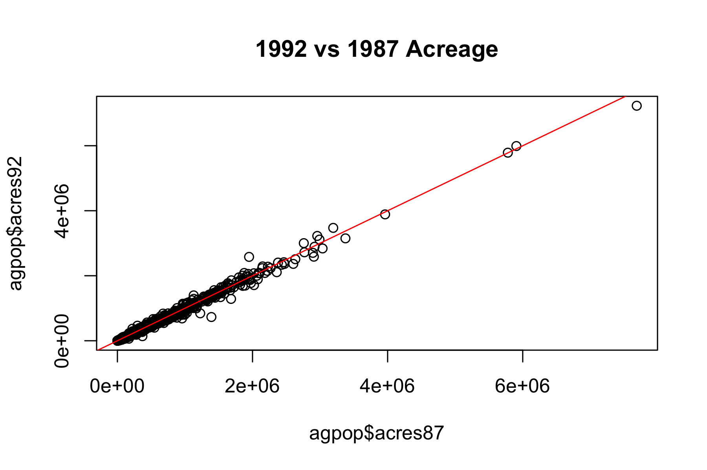

## Basic R Objects and Operations

```{r message=FALSE, warning=FALSE}
# create a vector
x <- 1:10
x <- seq(30, 3, by = -2)
a <- c(66.32, 69.87, 70.12, 90.37, 50.08, 61.20, 65.00, 57.65)
d <- a[1]
a[1] <- 85.34

mean(a)
ma <- mean(a)

# read a vector of numbers from a file (assumes files exist)
# x <- scan("data/numbers.txt")
# x2 <- scan("data/number2.txt")

# one can also read number without saving to a file
y <- scan(text = "7  8  9 10 11 12 13 13 14 17 17 45")

# create a matrix
A <- matrix(0, 4, 2)
A <- matrix(1:8, 4, 2)
A

D <- matrix(a, 4, 2, byrow = TRUE)
D <- matrix(1:8, 2, 4)
D

# create another matrix with all entry 0
B <- matrix(1:5000, 100, 50)

# assign a number to B
B[2,4] <- 45
head(B[1,]) # view part of the first row
head(B[,1]) # view part of the first column
B[1,] <- 1:50

# create a list
E <- list(newa = a, newA = A)
# list the names of components
names(E)
# to look at the component of E
E$newA 
E$newa <- 10:17

# create a dataframe
scores <- c(30, 45, 50)
names <- c("Peter", "John", "Alice")
stat245_scores <- data.frame(names, scores)
stat245_scores
stat245_scores$names
stat245_scores$scores[1] <- 40
```

## Import a Dataset as a dataframe and Simple Operations

```{r}
# import agpop.csv and treat -99 as NA
agpop <- read.csv("data/agpop.csv", na.strings = "-99")

# preview agpop
head(agpop)


# look at the variable names
colnames(agpop) 

# find number of cols and rows
ncol(agpop) 
nrow(agpop) 

# find mean and sd of acres92
mean(agpop$acres92, na.rm = TRUE)
sd(agpop$acres92, na.rm = TRUE)

## Modern summary table using gtsummary
# install.packages("gtsummary") # Run this once in your console if you don't have it
library("gtsummary")
agpop |> 
  select(region, acres92, acres87, largef92, farms92) |> 
  tbl_summary(
    by = region, 
    statistic = list(all_continuous() ~ "{mean} ({sd})")
  )
```

## Tables and Data Manipulation in R

### Modern Data Manipulation using `dplyr`

The `dplyr` package and the native pipe (`|>`) make modifying, subsetting, and summarizing data frames much cleaner than base R.

```{r message=FALSE, warning=FALSE}
library(dplyr)

# 1. Modifying an existing data frame with mutate()
# Instead of updating columns one by one with $, we can create multiple new columns at once
stat245_scores <- stat245_scores |>
  mutate(
    perc = scores / 50 * 100,
    adj = perc + 10
  )
stat245_scores

# 2. Filter rows based on conditions
agpop_AK <- agpop |> filter(state == "AK")
agpop_W <- agpop |> filter(region == "W")
agpop_largefarm <- agpop |> filter(largef92 > 10)

# 3. Select specific columns and slice specific rows
# This replaces base R: agpop[1:20, c("acres92", "largef92")]
agpop_subset <- agpop |> 
  slice(1:20) |> 
  select(acres92, largef92)

head(agpop_subset)
```

### Displaying Large Datasets with a Scroll Bar

When working with large datasets, printing the entire dataframe to your HTML document takes up too much vertical space and can slow down the browser. We can use the `gt` package to create a fixed-height, scrollable window. 

```{r message=FALSE, warning=FALSE}
library(gt)

# Display a large subset of the data inside a scrollable box
agpop |> 
  slice(1:100) |> # Slicing the first 100 rows prevents the HTML file from becoming too large
  gt() |> 
  tab_header(
    title = "Agricultural Population Data",
    subtitle = "Scroll to view more rows"
  ) |> 
  tab_options(
    container.height = px(400),   # Restricts the table height to 400 pixels
    container.overflow.y = TRUE   # Enables the vertical scroll bar
  )
```
**Output Note:** The `gt` table provides a clean, professional display of the dataset, confining the long list of rows within a manageable 400-pixel-high scrolling container.

### Advanced Tables with `gt`

The `gt` package also allows you to create highly customized, publication-ready tables. Below, we summarize the `agpop` dataset by region and create a table featuring a spanning header across multiple columns and complex mathematical LaTeX symbols in the column labels.

```{r message=FALSE, warning=FALSE}
# Create a summary dataset by region, filtering out missing values (-99)
ag_summary <- agpop |>
  filter(acres92 != -99, acres87 != -99) |>
  group_by(region) |>
  summarize(
    mean_92 = mean(acres92, na.rm = TRUE),
    mean_87 = mean(acres87, na.rm = TRUE),
    diff = mean_92 - mean_87
  )

# Display the summary using a customized gt table
ag_summary |>
  gt() |>
  tab_header(
    title = "Regional Farm Acreage Summary",
    subtitle = "Comparing 1987 and 1992"
  ) |>
  # Add a spanning header over the two mean columns
  tab_spanner(
    label = md("**Average Acreage**"),
    columns = c(mean_92, mean_87)
  ) |>
  # Use LaTeX math expressions for column names
  cols_label(
    region = md("**Region**"),
    mean_92 = md("$\\bar{y}_{1992}$"),
    mean_87 = md("$\\bar{x}_{1987}$"),
    diff = md("$\\Delta = \\bar{y}_{1992} - \\bar{x}_{1987}$")
  ) |>
  fmt_number(
    columns = c(mean_92, mean_87, diff),
    decimals = 1
  ) |>
  tab_options(table.width = pct(80))
```

## Graphics in R 

### Base R Graphics

Base R includes built-in functions for quickly generating standard plots.

```{r }
hist(agpop$acres92, main = "Histogram of 1992 Acres", xlab = "Acres")
plot(agpop$acres87, agpop$acres92, main = "1992 vs 1987 Acreage")
abline(a = 0, b = 1, col = "red")
```

Here is the new sub-section you can add right below your standard plotting chunk to explain this workflow to your readers.

### Saving and Inserting External Plots

Sometimes you need to export a high-resolution plot for a journal submission or a presentation. You can save a plot directly to your computer by opening a "graphics device" (like `pdf()`, `png()`, or `jpeg()`), running your plot code, and then closing the device with `dev.off()`.

```{r results='hide'}
# 1. Open the PNG device with high resolution (res = 300)
# Note: When increasing resolution, you must also scale up the width/height in pixels or specify units in inches.
png("agpop_scatter_highres.png", width = 6, height = 4, units = "in", res = 300)

plot(agpop$acres87, agpop$acres92, main = "1992 vs 1987 Acreage")
abline(a = 0, b = 1, col = "red")

dev.off()

```

Once the file is saved in your project folder, you can insert it back into your Quarto document at any time using the `knitr` package.

```{r fig.cap="My Imported PNG Plot"}
# Insert the saved PDF back into the document


```


### Advanced Visualization with `ggplot2`

While base R graphics are useful for quick checks, `ggplot2` provides a powerful grammar of graphics for complex visuals. Below, we generate a histogram of log-transformed 1992 acreages, overlaying both an empirical density curve and a theoretical normal distribution curve.

```{r message=FALSE, warning=FALSE}
library(ggplot2)

# Modern data prep with pipes
ag_clean <- agpop |>
  filter(acres92 != -99, acres92 > 0) |>
  mutate(log_acres = log(acres92))

# Calculate parameters for the theoretical normal curve
mean_log <- mean(ag_clean$log_acres)
sd_log <- sd(ag_clean$log_acres)

ggplot(ag_clean, aes(x = log_acres)) +
  # 1. Base Histogram mapped to density (instead of count)
  geom_histogram(aes(y = after_stat(density)), bins = 30, 
                 fill = "steelblue", color = "white", alpha = 0.7) +
  # 2. Empirical Density Curve (Dark Red)
  geom_density(color = "darkred", linewidth = 1.2) +
  # 3. Theoretical Normal Curve (Black, Dashed)
  stat_function(fun = dnorm, 
                args = list(mean = mean_log, sd = sd_log), 
                color = "black", linetype = "dashed", linewidth = 1) +
  labs(
    title = "Distribution of Log(Acres92)",
    subtitle = "Histogram with Empirical Density (Red) and Normal Fit (Black Dashed)",
    x = "Log of 1992 Farm Acreage",
    y = "Density"
  ) +
  theme_minimal()
```

## Create your own function

```{r }
## data is a matrix or data.frame
means_col <- function(data)
{
    n <- ncol(data)
    cmeans <- rep(NA, n)
    for (j in 1:n)
    {
        cmeans[j] <- mean(data[,j], na.rm = TRUE)
    }
    cmeans
}


```


```{r message=FALSE, warning=FALSE}
library(gt)

## apply custom function (using dplyr to select numeric columns first)
agpop_numeric <- agpop |> select(3:13)
custom_means <- means_col(agpop_numeric)

## apply R built-in function
builtin_means <- colMeans(agpop_numeric, na.rm = TRUE)

## Create a data frame to compare the results
comparison_df <- data.frame(
  Variable = colnames(agpop_numeric),
  Custom_Function = custom_means,
  Built_in = builtin_means
)

## Display the comparison as a clean table
comparison_df |> 
  gt() |> 
  tab_header(
    title = "Comparing Mean Calculations",
    subtitle = "Custom Function vs. Base R colMeans()"
  ) |> 
  cols_label(
    Variable = md("**Variable**"),
    Custom_Function = md("**Custom `means_col()`**"),
    Built_in = md("**Base `colMeans()`**")
  ) |> 
  fmt_number(
    columns = c(Custom_Function, Built_in),
    decimals = 2
  )
```
**Output Note:** Displaying the results side-by-side confirms that our custom `means_col()` function produces the exact same output as R's highly optimized built-in `colMeans()` function.
