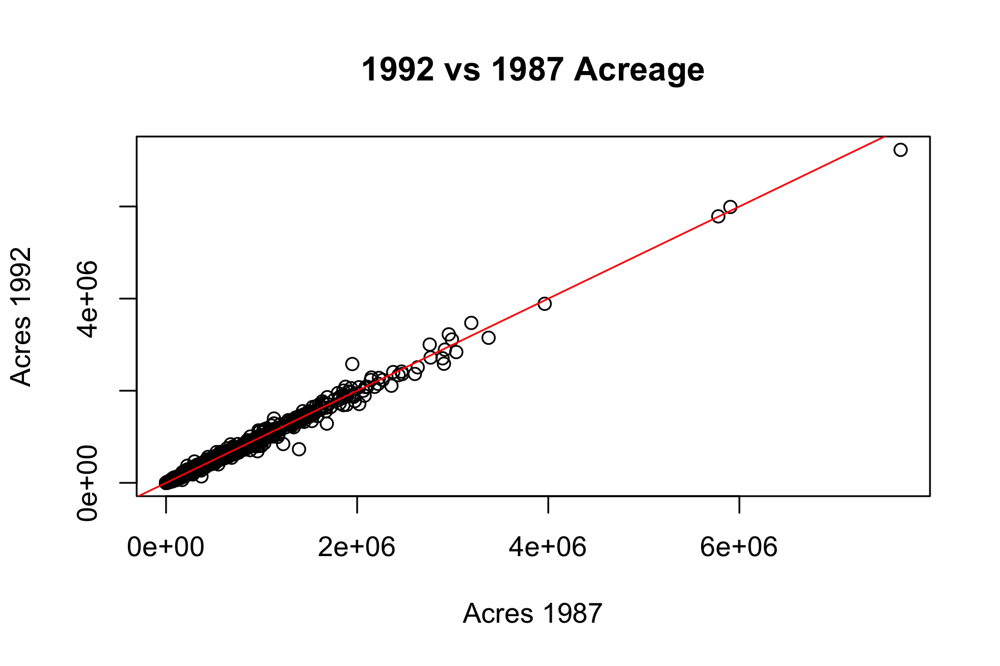

```{r setup}
library(dplyr)
library(gt)
library(gtsummary)
library(ggplot2)
```

All packages are loaded once in a hidden `setup` chunk, and `message`/`warning` suppression is set globally in the YAML header rather than repeated on every chunk.

## Foundations

### Basic R objects

```{r basic-r-objects}
# vectors
x <- seq(30, 3, by = -2)
a <- c(66.32, 69.87, 70.12, 90.37, 50.08, 61.20, 65.00, 57.65)

a[1]            # extract an element
a[1] <- 85.34   # replace an element
ma <- mean(a)
ma

# read a vector of numbers from text without saving a file first
y <- scan(text = "7 8 9 10 11 12 13 13 14 17 17 45")
y

# matrices: matrix() fills by column unless byrow = TRUE
A <- matrix(1:8, nrow = 4, ncol = 2)
A

D <- matrix(a, nrow = 4, ncol = 2, byrow = TRUE)
D

# a larger matrix, to illustrate element and row assignment
B <- matrix(1:5000, nrow = 100, ncol = 50)
B[2, 4] <- 45
B[1, ] <- 1:50
head(B[1, ])   # part of the first row
head(B[, 1])   # part of the first column

# lists
E <- list(newa = a, newA = A)
names(E)
E$newA
E$newa <- 10:17

# data frames
stat245_scores <- data.frame(
  student = c("Peter", "John", "Alice"),
  score   = c(30, 45, 50)
)
stat245_scores
```

The column of names is called `student` rather than `names`, so that the base function `names()` is not masked.

## Importing a dataset

```{r import-agpop}
data_url <- "https://raw.githubusercontent.com/longhaiSK/sampling/main/data/"
agpop_file <- paste0(data_url, "agpop.csv")

# -99 is the missing-value code in this file, so convert it to NA on import
agpop <- read.csv(agpop_file, na.strings = "-99")

colnames(agpop)
c(rows = nrow(agpop), cols = ncol(agpop))
```

Because `na.strings = "-99"` is applied at import, every `-99` is already `NA` in `agpop`. All later filtering therefore uses `is.na()`; comparisons such as `acres92 != -99` no longer identify the missing values.

### Displaying the full dataset

Printing several thousand rows into an HTML document consumes vertical space and slows the browser. With `df-print: paged` (set under `format: html` in the YAML header), a printed data frame appears as a paged table: all rows are embedded as one lightweight data blob, and only the current page is drawn. Static targets such as Typst or PDF have no pager, so only the first rows are shown there.

::: {.content-visible when-format="html"}

```{r agpop-paged}
agpop
```

:::

::: {.content-visible unless-format="html"}

```{r agpop-head}
head(agpop)
```

:::

### Simple summaries

```{r agpop-summaries}
mean(agpop$acres92, na.rm = TRUE)
sd(agpop$acres92, na.rm = TRUE)
```

## The native pipe

The native pipe `|>` takes the value on its left and passes it as the **first argument** to the function on its right, so `x |> f()` is another way of writing `f(x)`. Pipes chain, so the output of one step feeds the next.

```{r pipe-basics}
x <- c(1, 2, 3, 4, 5, NA)

# without the pipe
sum(x, na.rm = TRUE)
log(sum(x, na.rm = TRUE), base = 10)
round(exp(log(sum(x, na.rm = TRUE), base = 10)), digits = 2)

# the same computations, read left to right
x |> sum(na.rm = TRUE)
x |> sum(na.rm = TRUE) |> log(base = 10)
x |> sum(na.rm = TRUE) |> log(base = 10) |> exp() |> round(digits = 2)
```

Extra arguments are supplied by name at each step; only the first argument comes from the pipe.

```{r pipe-extra-args}
c(1, 4, 9, 16, NA) |>
  sum(na.rm = TRUE) |>
  sqrt() |>
  round(digits = 1)

c(5, 1, NA, 3, 9) |>
  sort(decreasing = TRUE, na.last = NA) |>
  mean(trim = 0.1)
```

When the piped value belongs in an argument other than the first, mark its position with the placeholder `_`. The argument holding `_` must be named. This requires R 4.2.0 or later.

```{r pipe-placeholder}
# mtcars is the `data` argument of lm(), not its first argument
lm(mpg ~ disp, data = mtcars)

mtcars |> lm(mpg ~ disp, data = _)
```

## Data manipulation with dplyr

`dplyr` verbs take a data frame as their first argument, which makes them natural pipe targets.

```{r dplyr-mutate}
# mutate() creates several columns at once, replacing repeated $ assignment
stat245_scores <- stat245_scores |>
  mutate(
    perc = score / 50 * 100,
    adj  = perc + 10
  )
stat245_scores
```

```{r dplyr-filter-select}
# filter() subsets rows
agpop_AK <- agpop |> filter(state == "AK")
agpop_W  <- agpop |> filter(region == "W")
agpop_lg <- agpop |> filter(largef92 > 10)

c(AK = nrow(agpop_AK), W = nrow(agpop_W), largefarm = nrow(agpop_lg))

# slice() subsets rows by position and select() subsets columns;
# together they replace agpop[1:20, c("acres92", "largef92")]
agpop_subset <- agpop |>
  slice(1:20) |>
  select(acres92, largef92)

head(agpop_subset)
```

```{r dplyr-summarize}
vars_of_interest <- c("acres92", "acres87", "farms92", "largef92", "smallf92")

# group_by() + summarize() + across(): mean and variance of each variable by
# region, over counties that are complete on all five variables
ag_summary <- agpop |>
  filter(if_all(all_of(vars_of_interest), ~ !is.na(.x))) |>
  group_by(region) |>
  summarize(
    across(
      all_of(vars_of_interest),
      list(mean = ~ mean(.x), var = ~ var(.x)),
      .names = "{.col}_{.fn}"
    ),
    .groups = "drop"
  )
ag_summary
```

Restricting to complete cases with `if_all(..., ~ !is.na(.x))` makes the means and variances comparable across variables, since each is computed on the same set of counties.

## Tables with gt

`gt()` writes every row as styled HTML, even inside a scrolling container, so a full-size dataset enlarges the file and slows rendering. Reduce the data first (e.g. with `slice_head()` or a `summarize()` step); for browsing raw data, the paged display in the import section is the better tool.

### Spanning headers grouped by statistic

`tab_spanner()` groups columns under a shared header. Here the means are grouped together and the variances are grouped together.

```{r tbl-region-summary-by-statistic}
#| tbl-cap: "Regional summary of five variables, grouped by statistic"
ag_summary |>
  gt() |>
  tab_header(
    title = "Regional Summary: Mean and Variance of Five Variables",
    subtitle = "acres92, acres87, farms92, largef92, smallf92"
  ) |>
  tab_spanner(label = md("**Mean**"),     columns = ends_with("_mean")) |>
  tab_spanner(label = md("**Variance**"), columns = ends_with("_var")) |>
  cols_label(
    region        = md("**Region**"),
    acres92_mean  = md("$\\bar{y}_{acres92}$"),
    acres87_mean  = md("$\\bar{y}_{acres87}$"),
    farms92_mean  = md("$\\bar{y}_{farms92}$"),
    largef92_mean = md("$\\bar{y}_{largef92}$"),
    smallf92_mean = md("$\\bar{y}_{smallf92}$"),
    acres92_var   = md("$s^2_{acres92}$"),
    acres87_var   = md("$s^2_{acres87}$"),
    farms92_var   = md("$s^2_{farms92}$"),
    largef92_var  = md("$s^2_{largef92}$"),
    smallf92_var  = md("$s^2_{smallf92}$")
  ) |>
  fmt_number(columns = ends_with("_mean"), decimals = 1) |>
  fmt_number(columns = ends_with("_var"), decimals = 0, sep_mark = ",") |>
  tab_options(table.width = pct(100))
```

The `$...$` labels are typeset by the HTML math engine after the table is written into the page; they are not processed by `gt` itself, and will appear as literal dollar signs in the Typst output. For a target-independent version, replace them with plain text or Unicode labels.

### Spanning headers grouped by variable

Reordering the columns with `select()` puts each variable's mean and variance side by side under one spanner.

```{r tbl-region-summary-by-variable}
#| tbl-cap: "Regional summary of five variables, grouped by variable"
ag_summary |>
  select(
    region,
    acres92_mean,  acres92_var,
    acres87_mean,  acres87_var,
    farms92_mean,  farms92_var,
    largef92_mean, largef92_var,
    smallf92_mean, smallf92_var
  ) |>
  gt() |>
  tab_header(
    title = "Regional Summary: Mean and Variance of Five Variables",
    subtitle = "Grouped by variable"
  ) |>
  tab_spanner(label = md("**acres92**"),  columns = c(acres92_mean, acres92_var)) |>
  tab_spanner(label = md("**acres87**"),  columns = c(acres87_mean, acres87_var)) |>
  tab_spanner(label = md("**farms92**"),  columns = c(farms92_mean, farms92_var)) |>
  tab_spanner(label = md("**largef92**"), columns = c(largef92_mean, largef92_var)) |>
  tab_spanner(label = md("**smallf92**"), columns = c(smallf92_mean, smallf92_var)) |>
  # the spanner already names the variable, so the labels can stay generic
  cols_label(
    region        = md("**Region**"),
    acres92_mean  = md("$\\bar y$"), acres92_var  = md("$s^2$"),
    acres87_mean  = md("$\\bar y$"), acres87_var  = md("$s^2$"),
    farms92_mean  = md("$\\bar y$"), farms92_var  = md("$s^2$"),
    largef92_mean = md("$\\bar y$"), largef92_var = md("$s^2$"),
    smallf92_mean = md("$\\bar y$"), smallf92_var = md("$s^2$")
  ) |>
  fmt_number(columns = ends_with("_mean"), decimals = 1) |>
  fmt_number(columns = ends_with("_var"), decimals = 0, sep_mark = ",") |>
  tab_options(table.width = pct(100))
```

Both tables report identical numbers; only the grouping differs. Grouping by variable eases comparison of a variable's mean against its variance, whereas grouping by statistic eases comparison of means across variables.

### Automatic summary tables with gtsummary

`gtsummary::tbl_summary()` produces a descriptive table directly from the raw data, without a `summarize()` step.

```{r tbl-gtsummary-region}
#| tbl-cap: "Automatic descriptive summary of agpop variables by region"
agpop |>
  select(region, acres92, acres87, largef92, farms92) |>
  tbl_summary(
    by = region,
    statistic = list(all_continuous() ~ "{mean} ({sd})")
  )
```

## Graphics

### Base R graphics

Base R is convenient for quick diagnostic plots.

```{r fig-agpop-acres92-hist}
#| fig-cap: "Histogram of 1992 farm acreage"
hist(agpop$acres92, main = "Histogram of 1992 Acres", xlab = "Acres")
```

```{r fig-agpop-acres-scatter}
#| fig-cap: "1992 vs. 1987 farm acreage, with the 1:1 line"
plot(agpop$acres87, agpop$acres92,
     main = "1992 vs 1987 Acreage",
     xlab = "Acres 1987", ylab = "Acres 1992")
abline(a = 0, b = 1, col = "red")
```

### Saving and re-inserting an external plot

A high-resolution figure for a journal or a slide deck can be written straight to disk: open a graphics device (`png()`, `pdf()`, `jpeg()`), run the plotting code, then close the device with `dev.off()`. When `res` is raised, `width` and `height` must be given in inches so the figure does not shrink.

```{r save-png-plot}
#| results: hide
dir.create("figures", showWarnings = FALSE)

png("figures/agpop_scatter_highres.png",
    width = 6, height = 4, units = "in", res = 300)

plot(agpop$acres87, agpop$acres92,
     main = "1992 vs 1987 Acreage",
     xlab = "Acres 1987", ylab = "Acres 1992")
abline(a = 0, b = 1, col = "red")

dev.off()
```

The saved file can then be placed back into the document with `knitr::include_graphics()`.

```{r fig-agpop-scatter-highres}
#| fig-cap: "The saved high-resolution PNG, re-inserted"

```

### Advanced visualization with ggplot2

`ggplot2` provides a grammar of graphics for layered displays. Below, a histogram of log-transformed 1992 acreage carries both an empirical density curve and a fitted normal curve.

```{r fig-log-acres-hist}
#| fig-cap: "Distribution of log(acres92): histogram with empirical density and normal fit"
ag_clean <- agpop |>
  filter(!is.na(acres92), acres92 > 0) |>
  mutate(log_acres = log(acres92))

mean_log <- mean(ag_clean$log_acres)
sd_log   <- sd(ag_clean$log_acres)

ggplot(ag_clean, aes(x = log_acres)) +
  geom_histogram(aes(y = after_stat(density)), bins = 30,
                 fill = "steelblue", color = "white", alpha = 0.7) +
  geom_density(color = "darkred", linewidth = 1.2) +
  stat_function(
    fun = dnorm,
    args = list(mean = mean_log, sd = sd_log),
    color = "black", linetype = "dashed", linewidth = 1
  ) +
  labs(
    title = "Distribution of Log(Acres92)",
    subtitle = "Histogram with empirical density (red) and normal fit (black dashed)",
    x = "Log of 1992 farm acreage",
    y = "Density"
  ) +
  theme_minimal()
```

Mapping the histogram to `after_stat(density)` puts it on the same vertical scale as the two curves, so the three layers are directly comparable.

## Writing your own function

```{r custom-function-def}
## data is a matrix or data frame; returns the mean of each column
means_col <- function(data) {
  n <- ncol(data)
  cmeans <- rep(NA_real_, n)
  for (j in seq_len(n)) {
    cmeans[j] <- mean(data[[j]], na.rm = TRUE)
  }
  names(cmeans) <- colnames(data)
  cmeans
}
```

Indexing with `data[[j]]` extracts column `j` as a vector for both data frames and tibbles, whereas `data[, j]` returns a one-column tibble in the tibble case. `seq_len(n)` is used in place of `1:n` so that a zero-column input yields an empty loop rather than iterating over `1, 0`.

```{r tbl-means-custom-vs-builtin}
#| tbl-cap: "Comparing column means: custom function vs. base R colMeans()"
agpop_numeric <- agpop |> select(where(is.numeric))

custom_means  <- means_col(agpop_numeric)
builtin_means <- colMeans(agpop_numeric, na.rm = TRUE)

data.frame(
  Variable        = colnames(agpop_numeric),
  Custom_Function = custom_means,
  Built_in        = builtin_means,
  row.names       = NULL
) |>
  gt() |>
  tab_header(
    title = "Comparing Mean Calculations",
    subtitle = "Custom function vs. base R colMeans()"
  ) |>
  cols_label(
    Variable        = md("**Variable**"),
    Custom_Function = md("**Custom `means_col()`**"),
    Built_in        = md("**Base `colMeans()`**")
  ) |>
  fmt_number(columns = c(Custom_Function, Built_in), decimals = 2)
```

```{r check-equality}
all.equal(custom_means, builtin_means)
```

Selecting numeric columns with `where(is.numeric)` is preferable to the positional `select(3:13)`, which breaks silently if the column order of the source file changes. The `all.equal()` result confirms agreement with the optimized built-in.
