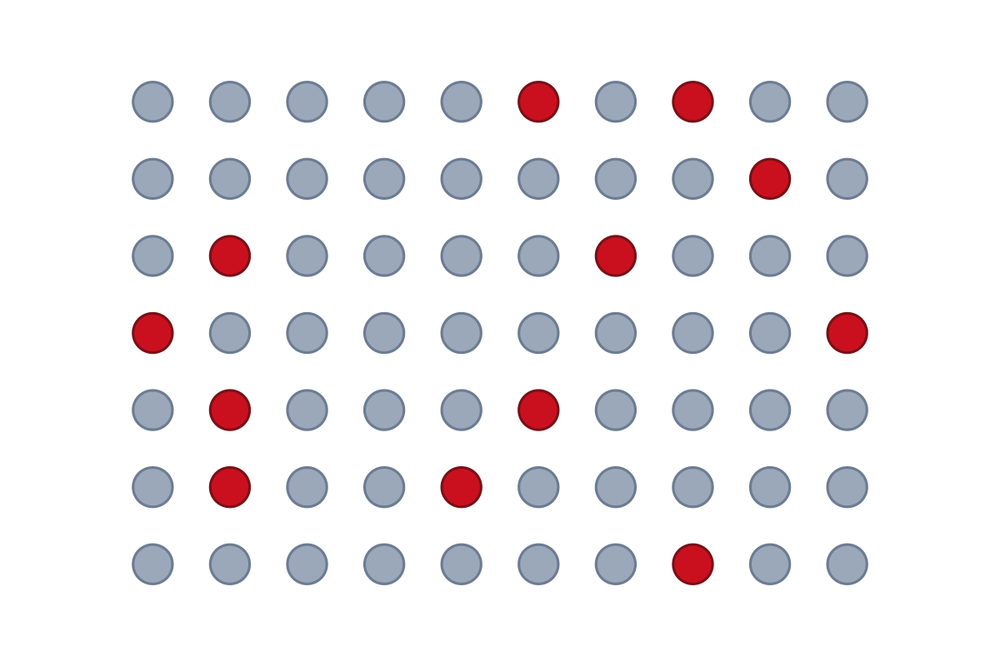
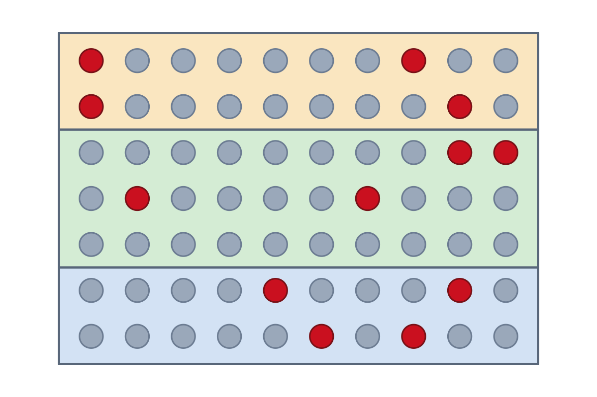
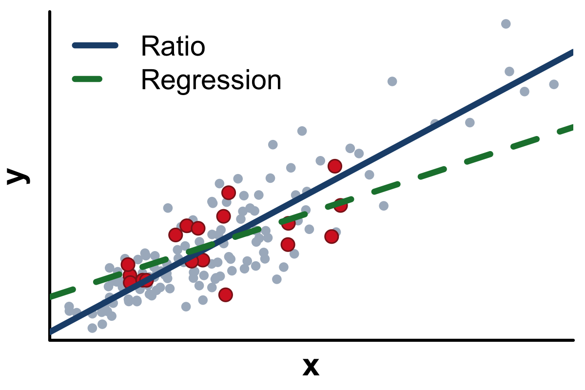
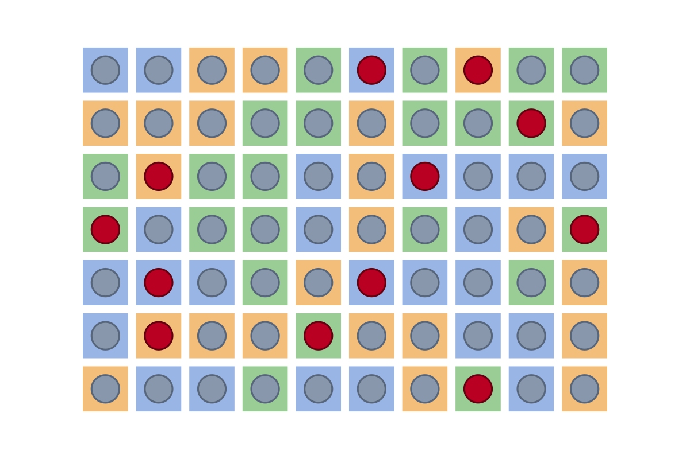
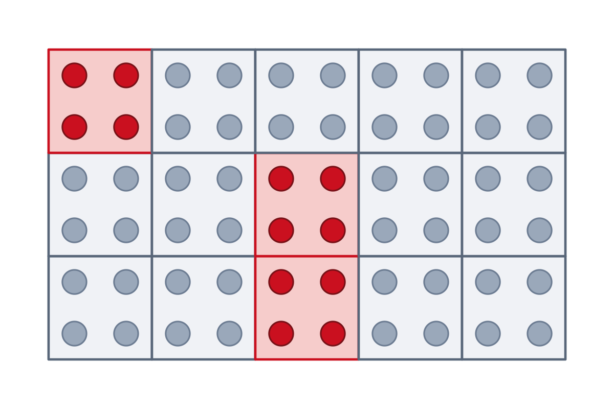
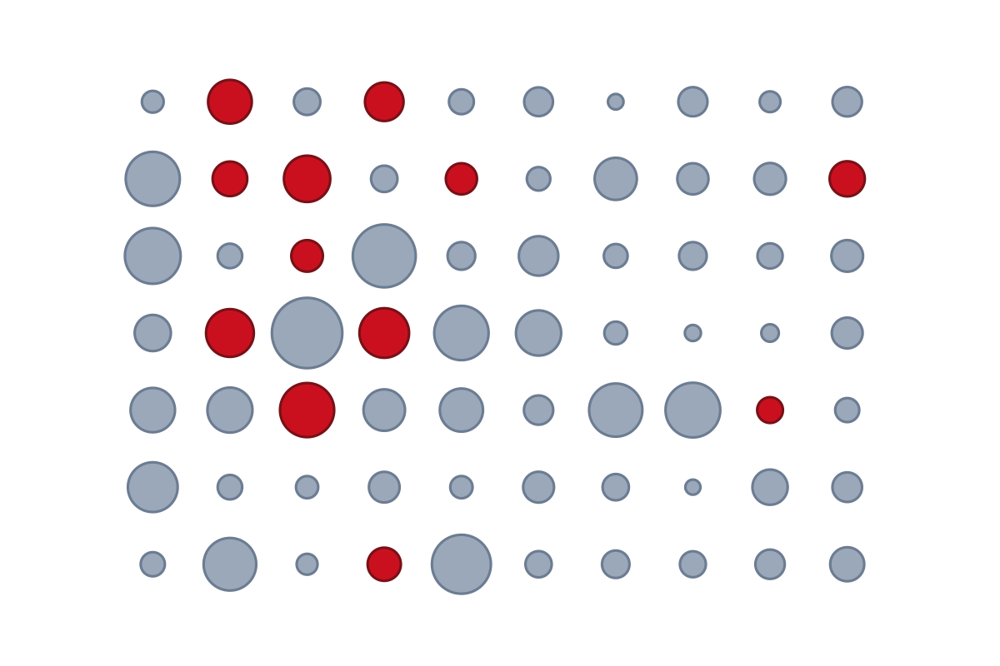

<table class="toc">
<tr>
<td><a href="app-srs.html">Simple Random Sampling</a></td>
<td><a href="app-stratified.html">Stratified Sampling</a></td>
<td><a href="app-ratio.html">Ratio and Regression Estimation</a></td>
</tr>
<tr>
<td><a href="app-poststrat.html">Post-stratification</a></td>
<td><a href="app-cluster.html">Two-Stage Cluster Sampling</a></td>
<td><a href="app-ups.html">Unequal Probability Sampling</a></td>
</tr>
</table>
