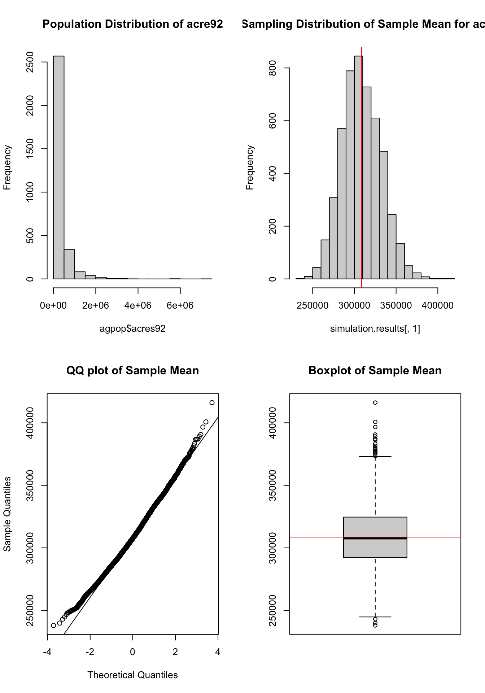
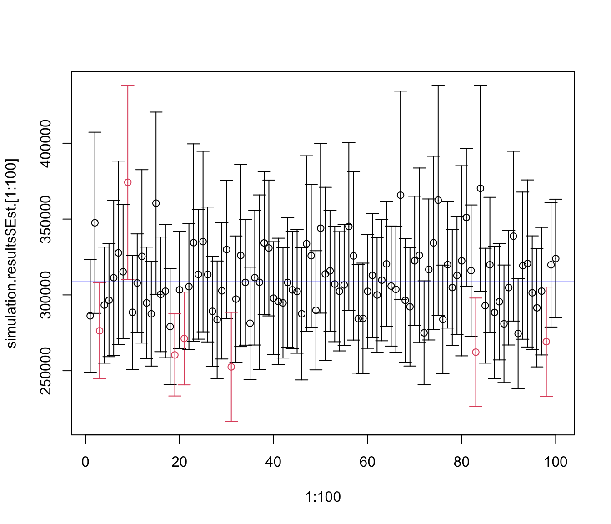

## Analysis of agsrs.csv Data

### Step by step calculation without using a function

To evaluate a Simple Random Sample (SRS), we calculate the point estimate, the standard error (incorporating the Finite Population Correction factor), and the margin of error to construct a 95% confidence interval.

**Key Formulas:**

* **Sample Mean:** $\bar{y} = \frac{1}{n} \sum_{i=1}^n y_i$
* **Standard Error:** $\mathrm{SE}(\bar{y}) = \sqrt{1 - \frac{n}{N}} \left( \frac{s}{\sqrt{n}} \right)$
* **Margin of Error:** $\mathrm{ME} = t_{\alpha/2, n-1} \times \mathrm{SE}(\bar{y})$
* **Population Total:** $\hat{t} = N\bar{y}$


::: {.cell}

```{.r .cell-code}
## read survey data
agsrs <- read.csv ("data/agsrs.csv")
head(agsrs)
```

::: {.cell-output-display}
`````{=html}
<div data-pagedtable="false">
  <script data-pagedtable-source type="application/json">
{"columns":[{"label":[""],"name":["_rn_"],"type":[""],"align":["left"]},{"label":["county"],"name":[1],"type":["chr"],"align":["left"]},{"label":["state"],"name":[2],"type":["chr"],"align":["left"]},{"label":["acres92"],"name":[3],"type":["int"],"align":["right"]},{"label":["acres87"],"name":[4],"type":["int"],"align":["right"]},{"label":["acres82"],"name":[5],"type":["int"],"align":["right"]},{"label":["farms92"],"name":[6],"type":["int"],"align":["right"]},{"label":["farms87"],"name":[7],"type":["int"],"align":["right"]},{"label":["farms82"],"name":[8],"type":["int"],"align":["right"]},{"label":["largef92"],"name":[9],"type":["int"],"align":["right"]},{"label":["largef87"],"name":[10],"type":["int"],"align":["right"]},{"label":["largef82"],"name":[11],"type":["int"],"align":["right"]},{"label":["smallf92"],"name":[12],"type":["int"],"align":["right"]},{"label":["smallf87"],"name":[13],"type":["int"],"align":["right"]},{"label":["smallf82"],"name":[14],"type":["int"],"align":["right"]},{"label":["region"],"name":[15],"type":["chr"],"align":["left"]}],"data":[{"1":"COFFEE COUNTY","2":"AL","3":"175209","4":"179311","5":"194509","6":"760","7":"842","8":"944","9":"29","10":"28","11":"21","12":"57","13":"47","14":"66","15":"S","_rn_":"1"},{"1":"COLBERT COUNTY","2":"AL","3":"138135","4":"145104","5":"161360","6":"488","7":"563","8":"686","9":"37","10":"41","11":"42","12":"12","13":"44","14":"47","15":"S","_rn_":"2"},{"1":"LAMAR COUNTY","2":"AL","3":"56102","4":"59861","5":"72334","6":"299","7":"362","8":"447","9":"4","10":"4","11":"3","12":"16","13":"20","14":"30","15":"S","_rn_":"3"},{"1":"MARENGO COUNTY","2":"AL","3":"199117","4":"220526","5":"231207","6":"434","7":"471","8":"622","9":"48","10":"66","11":"62","12":"14","13":"11","14":"28","15":"S","_rn_":"4"},{"1":"MARION COUNTY","2":"AL","3":"89228","4":"105586","5":"113618","6":"566","7":"658","8":"748","9":"7","10":"9","11":"9","12":"11","13":"23","14":"27","15":"S","_rn_":"5"},{"1":"TUSCALOOSA COUNTY","2":"AL","3":"96194","4":"120542","5":"134616","6":"436","7":"521","8":"650","9":"20","10":"17","11":"23","12":"18","13":"32","14":"29","15":"S","_rn_":"6"}],"options":{"columns":{"min":{},"max":[10]},"rows":{"min":[10],"max":[10]},"pages":{}}}
  </script>
</div>
`````
:::

```{.r .cell-code}
## extract the variable of interest
sdata <- agsrs$acres92
N <- 3078

## do calculation
n <- length (sdata)
ybar <- mean (sdata)
se.ybar <- sqrt((1 - n / N)) * sd (sdata) / sqrt(n)  
mem <- qt (0.975, df = n - 1) * se.ybar

## return estimate vector for pop mean
c (Est. = ybar, S.E. = se.ybar, ci.low = ybar - mem, ci.upp = ybar + mem)
```

::: {.cell-output .cell-output-stdout}

```
     Est.      S.E.    ci.low    ci.upp 
297897.05  18898.43 260706.26 335087.84 
```


:::

```{.r .cell-code}
## return estimate vector for pop total
c (Est. = ybar, S.E. = se.ybar, ci.low = ybar - mem, ci.upp = ybar + mem) * N
```

::: {.cell-output .cell-output-stdout}

```
      Est.       S.E.     ci.low     ci.upp 
 916927110   58169381  802453859 1031400361 
```


:::
:::


### Write a function for repeated use

#### A function for doing data analysis for srs sample

Wrap the previous manual calculations into a custom R function to quickly estimate means, standard errors, and confidence intervals for any variable of interest. To avoid repeating this code in every chapter, all estimating functions (and their `gt`-table formatting helpers) live in a single shared file, `samplingestimate.r`, which we source below.


::: {.cell}

:::


::: {.content-visible when-format="html"}

<details>
<summary>Show the shared estimating functions (`samplingestimate.r`)</summary>

```r
# =============================================================
# Shared estimation functions for the Elements of Sampling Survey
# book. Source this file from any chapter that needs point/SE/CI
# estimators or their gt-table formatting helpers, e.g.:
#
#   source("samplingestimate.r")
#
# =============================================================

suppressPackageStartupMessages({
    library(gt)
})

# ---------------------------------------------------------
# Shared gt-table helpers
# ---------------------------------------------------------

## Formats a gt table column as ordinary fixed-point, UNLESS its values are
## too small (< `small` in absolute value) or too large (>= `large`), in
## which case it switches that column to scientific notation (rendered as
## "m x 10^n" via gt's exp_style = "x10n") instead.
fmt_auto <- function (gt_tbl, data, columns, decimals = 3, small = 1e-3, large = 1e5)
{
    for (col in columns)
    {
        x <- data[[col]]
        x <- x[is.finite (x) & x != 0]
        if (length (x) == 0) next
        if (any (abs (x) < small) || any (abs (x) >= large))
            gt_tbl <- fmt_scientific (gt_tbl, columns = tidyselect::all_of (col), decimals = decimals, exp_style = "x10n")
        else
            gt_tbl <- fmt_number (gt_tbl, columns = tidyselect::all_of (col), decimals = decimals)
    }
    gt_tbl
}

## Formats a single scalar for inline formula display (fixed-point with
## thousands separators, switching to "m \times 10^{n}" LaTeX scientific
## notation for very small or very large magnitudes, mirroring fmt_auto()'s
## use of exp_style = "x10n") --- used to show worked-example steps such as
## \bar y = sum/n with the actual numbers plugged in.
fmt_num <- function (x, decimals = 3, small = 1e-3, large = 1e5)
{
    use_sci <- is.finite (x) & x != 0 & (abs (x) < small | abs (x) >= large)
    exps    <- ifelse (x == 0, 0, floor (log10 (abs (x))))
    mant    <- ifelse (x == 0, 0, x / 10^exps)
    ifelse (use_sci,
            sprintf ("%s \\times 10^{%d}", formatC (mant, format = "f", digits = decimals), exps),
            formatC (x, format = "f", digits = decimals, big.mark = ","))
}

## Truncates a row-level working data.frame whose LAST row is a summary row
## (e.g. "Sum"/"Total"): if there are more than head_n data rows (excluding
## that summary row), keeps only the first head_n data rows, inserts one
## "..." placeholder row, then the summary row --- so long working tables
## stay readable. id_col --- name of the row-label column.
truncate_working <- function (working, id_col, head_n = 6)
{
    n <- nrow (working) - 1
    if (n <= head_n + 1) return (working)

    dots <- working[1, ]
    dots[1, ] <- NA
    dots[1, id_col] <- "..."

    rbind (working[seq_len (head_n), ], dots, working[nrow (working), ])
}

# Helper function to format estimation outputs with appropriate mathematical headers
format_est_gt <- function(est_data, est_type = c("mean", "total", "ratio", "reg_mean", "reg_total", "ratio_mean", "domain_mean")) {
  est_type <- match.arg(est_type)

  sym_map <- list(
    "mean"        = c(est = "$\\bar{y}$",         se = "$\\mathrm{SE}(\\bar{y})$"),
    "total"       = c(est = "$\\hat{t}$",         se = "$\\mathrm{SE}(\\hat{t})$"),
    "ratio"       = c(est = "$\\hat{B}$",         se = "$\\mathrm{SE}(\\hat{B})$"),
    "reg_mean"    = c(est = "$\\bar{y}_{reg}$",   se = "$\\mathrm{SE}(\\bar{y}_{reg})$"),
    "reg_total"   = c(est = "$\\hat{t}_{reg}$",   se = "$\\mathrm{SE}(\\hat{t}_{reg})$"),
    "ratio_mean"  = c(est = "$\\bar{y}_{r}$",     se = "$\\mathrm{SE}(\\bar{y}_{r})$"),
    "domain_mean" = c(est = "$\\bar{y}_{d}$",     se = "$\\mathrm{SE}(\\bar{y}_{d})$")
  )

  est_sym <- sym_map[[est_type]]["est"]
  se_sym  <- sym_map[[est_type]]["se"]

  # Convert to data frame. Use unname() to strip hidden lm() coefficient names
  if (is.vector(est_data) && !is.list(est_data)) {
    df <- as.data.frame(t(unname(est_data)))
  } else {
    df <- as.data.frame(est_data)
  }

  # Force standard column names so gt() never gets confused
  colnames(df) <- c("Est.", "S.E.", "ci.low", "ci.upp")

  # Check if we should use rownames as a stub
  use_stub <- !is.null(rownames(df)) && !all(rownames(df) == as.character(1:nrow(df)))

  df |>
    gt(rownames_to_stub = use_stub) |>
    cols_label(
      Est.   = md(est_sym),
      S.E.   = md(se_sym),
      ci.low = md("95% CI Lower"),
      ci.upp = md("95% CI Upper")
    ) |>
    fmt_number(
      columns = everything(),
      decimals = 4
    ) |>
    tab_options(table.width = pct(70))
}

## Formats an lm object as two gt tables, replacing the plain-text
## summary(lmfit) output:
##   $coef --- coefficient table (Estimate, S.E., t value, p value)
##   $fit  --- one-row table of model fit statistics, including R^2
## returns list($coef, $fit)
format_lm_gt <- function (lmfit)
{
    s <- summary (lmfit)

    coef_df <- as.data.frame (s$coefficients)
    colnames (coef_df) <- c ("Estimate", "S.E.", "t value", "p value")

    coef_gt <- coef_df |>
        gt (rownames_to_stub = TRUE) |>
        fmt_number (columns = c ("Estimate", "S.E.", "t value"), decimals = 4) |>
        fmt_number (columns = "p value", decimals = 4) |>
        tab_header (title = "Coefficient Estimates") |>
        tab_options (table.width = pct(70))

    fstat <- s$fstatistic
    fit_df <- data.frame (
        R.squared     = s$r.squared,
        Adj.R.squared = s$adj.r.squared,
        Sigma         = s$sigma,
        F.statistic   = unname (fstat["value"]),
        p.value       = unname (pf (fstat["value"], fstat["numdf"], fstat["dendf"], lower.tail = FALSE))
    )

    fit_gt <- fit_df |>
        gt () |>
        cols_label (
            R.squared     = md ("$R^2$"),
            Adj.R.squared = md ("Adj. $R^2$"),
            Sigma         = md ("$\\hat\\sigma$"),
            F.statistic   = "F-statistic",
            p.value       = "p-value"
        ) |>
        fmt_number (columns = everything (), decimals = 4) |>
        tab_header (title = "Model Fit Summary") |>
        tab_options (table.width = pct(70))

    list (coef = coef_gt, fit = fit_gt)
}

# ---------------------------------------------------------
# Base Estimators
# ---------------------------------------------------------

## sdata --- a vector of original survey data
## N --- population size
## estimate --- "mean" (default) returns the population MEAN estimate;
##              "total" returns the population TOTAL estimate (N * mean,
##              with SE/CI scaled accordingly); requires finite N
## show.details --- if TRUE (default), also return a gt table of the
##                  row-level working values y_i, y_i-\bar y, (y_i-\bar y)^2,
##                  with a Sum row and a footnote showing s_y^2; NULL otherwise
## returns list ($estimate = c(Est., S.E., ci.low, ci.upp), $table)
srs_est <- function (sdata, N = Inf, estimate = c ("mean", "total"),
                      show.details = TRUE, col_labels = list (y = "y_i"))
{
    estimate <- match.arg (estimate)

    n <- length (sdata)
    ybar <- mean (sdata)
    dev <- sdata - ybar
    s2y <- sum (dev^2) / (n - 1)
    se.ybar <- sqrt((1 - n / N)) * sd (sdata) / sqrt(n)

    if (estimate == "total")
    {
        if (!is.finite (N))
            stop ("N must be finite to compute estimate = \"total\"")
        est <- N * ybar
        se.est <- N * se.ybar
    }
    else
    {
        est <- ybar
        se.est <- se.ybar
    }
    mem <- qt (0.975, df = n - 1) * se.est
    estimate_vec <- c (Est. = est, S.E. = se.est, ci.low = est - mem, ci.upp = est + mem)

    if (!show.details)
        return (list (estimate = estimate_vec, table = NULL))

    working <- data.frame (
        i    = c (seq_len (n), "Sum"),
        y    = c (sdata, sum (sdata)),
        dev  = c (dev, sum (dev)),
        dev2 = c (dev^2, sum (dev^2))
    )
    working <- truncate_working (working, id_col = "i")

    table <- gt (working) |>
        tab_header (title = "SRS Mean Estimation: Working Table", subtitle = md (sprintf ("$n = %d$", n))) |>
        cols_label (
            i    = md ("$i$"),
            y    = md (sprintf ("$%s$", col_labels$y)),
            dev  = md (sprintf ("$%s-\\bar y$", col_labels$y)),
            dev2 = md (sprintf ("$(%s-\\bar y)^2$", col_labels$y))
        ) |>
        cols_width (i ~ px (40), everything () ~ px (110)) |>
        fmt_auto (data = working, columns = c ("y", "dev", "dev2"), decimals = 3) |>
        sub_missing (missing_text = "...") |>
        tab_style (
            style     = cell_text (weight = "bold"),
            locations = cells_body (rows = i == "Sum")
        ) |>
        tab_footnote (
            footnote  = md (sprintf ("$s_y^2 = \\sum_i (%s-\\bar y)^2/(n-1) = %.4f$.", col_labels$y, s2y)),
            locations = cells_column_labels (columns = dev2)
        ) |>
        tab_source_note (
            source_note = md (if (estimate == "total")
                sprintf ("**Point estimate:** $\\hat t = N\\bar y = %s \\times %s = %s$",
                         fmt_num (N, 0), fmt_num (ybar), fmt_num (est))
            else
                sprintf ("**Point estimate:** $\\bar y = \\dfrac{\\sum_i %s}{n} = \\dfrac{%s}{%d} = %s$",
                         col_labels$y, fmt_num (sum (sdata)), n, fmt_num (ybar)))
        ) |>
        tab_source_note (
            source_note = md (if (estimate == "total")
                sprintf ("**Standard error:** $\\mathrm{SE}(\\hat t) = N \\times \\mathrm{SE}(\\bar y) = %s \\times %s = %s$",
                         fmt_num (N, 0), fmt_num (se.ybar), fmt_num (se.est))
            else if (is.finite (N))
                sprintf ("**Standard error:** $\\mathrm{SE}(\\bar y) = \\sqrt{1-\\dfrac{n}{N}}\\,\\dfrac{s}{\\sqrt n} = \\sqrt{1-\\dfrac{%d}{%d}}\\,\\dfrac{%s}{\\sqrt{%d}} = %s$",
                         n, N, fmt_num (sqrt (s2y)), n, fmt_num (se.ybar))
            else
                sprintf ("**Standard error:** $\\mathrm{SE}(\\bar y) = \\dfrac{s}{\\sqrt n} = \\dfrac{%s}{\\sqrt{%d}} = %s$",
                         fmt_num (sqrt (s2y)), n, fmt_num (se.ybar)))
        )

    list (estimate = estimate_vec, table = table)
}

## ydata --- observations of the variable of interest
## xdata --- observations of the auxiliary variable
## xbarU --- population mean of the auxiliary variable; required when
##           estimate is "mean" or "total"; ignored when estimate = "model"
## N --- population size
## estimate --- "mean" (default) returns the ratio estimate of the
##              population MEAN of y, Bhat*xbarU; "total" returns the ratio
##              estimate of the population TOTAL of y (requires finite N);
##              "model" returns the raw ratio coefficient Bhat = ybar/xbar
##              itself (with its own SE)
## show.details --- if TRUE (default), also return a gt table of the
##                  row-level working values y_i, x_i, fitted yhat_i =
##                  Bhat*x_i, residual e_i, and e_i^2, with a Sum row and a
##                  footnote showing Bhat and s_e^2; NULL otherwise
## col_labels --- named list (y, x, yhat) of RAW latex for those
##                working-table columns, so this function can be reused
##                (e.g. by cluster_ratio(), upswr_ratio()) with
##                context-appropriate labels
## extra_col --- optional list (label, values, formula) adding one extra
##               RAW-latex-labelled column of per-unit `values` right before
##               the y column of the working table (e.g. the within-cluster
##               means $\bar y_i$ used by cluster_ratio() to build $\hat
##               t_i = \bar y_i M_i$); `formula` (optional) is shown as a
##               footnote on the y column documenting that relationship
## returns list ($estimate = c(Est., S.E., ci.low, ci.upp), $table)
ratio_est <- function (ydata, xdata, xbarU = NULL, N = Inf,
                        estimate = c ("mean", "total", "model"), show.details = TRUE,
                        col_labels = list (y = "y_i", x = "x_i", yhat = "\\hat y_i"),
                        extra_col = NULL)
{
  estimate <- match.arg (estimate)

  n <- length (xdata)
  xbar <- mean (xdata)
  ybar <- mean (ydata)
  B_hat <- ybar / xbar
  yhat <- B_hat * xdata
  e <- ydata - yhat
  var_e <- sum (e^2) / (n - 1)
  sd_B_hat <- sqrt ((1 - n/N) * var_e / n) / xbar

  if (estimate == "model")
  {
      est <- B_hat
      sd_est <- sd_B_hat
  }
  else
  {
      if (is.null (xbarU))
          stop ("xbarU (population mean of x) is required when estimate is \"mean\" or \"total\"")
      if (estimate == "total")
      {
          if (!is.finite (N))
              stop ("N must be finite to compute estimate = \"total\"")
          est <- B_hat * xbarU * N
          sd_est <- sd_B_hat * xbarU * N
      }
      else
      {
          est <- B_hat * xbarU
          sd_est <- sd_B_hat * xbarU
      }
  }

  mem <- qt (0.975, df = n - 1) * sd_est
  estimate_vec <- c (Est. = est, S.E. = sd_est, ci.low = est - mem, ci.upp = est + mem)

  if (!show.details)
      return (list (estimate = estimate_vec, table = NULL))

  working_cols <- list (i = c (seq_len (n), "Sum"))
  if (!is.null (extra_col))
      working_cols$extra <- c (extra_col$values, NA)
  working_cols$y    <- c (ydata, sum (ydata))
  working_cols$x    <- c (xdata, sum (xdata))
  working_cols$yhat <- c (yhat, sum (yhat))
  working_cols$e    <- c (e, sum (e))
  working_cols$e2   <- c (e^2, sum (e^2))
  working <- as.data.frame (working_cols, check.names = FALSE)
  working <- truncate_working (working, id_col = "i")

  fmt_cols <- c ("y", "x", "yhat", "e", "e2")
  if (!is.null (extra_col)) fmt_cols <- c ("extra", fmt_cols)

  label_args <- list (i = md ("$i$"))
  if (!is.null (extra_col))
      label_args$extra <- md (sprintf ("$%s$", extra_col$label))
  label_args$y    <- md (sprintf ("$%s$", col_labels$y))
  label_args$x    <- md (sprintf ("$%s$", col_labels$x))
  label_args$yhat <- md (sprintf ("$%s$", col_labels$yhat))
  label_args$e    <- md ("$e_i$")
  label_args$e2   <- md ("$e_i^2$")

  table <- gt (working) |>
      tab_header (title = "Ratio Estimation: Working Table", subtitle = md (sprintf ("$n = %d$", n)))
  table <- do.call (cols_label, c (list (table), label_args))
  table <- table |>
      cols_width (i ~ px (40), everything () ~ px (100)) |>
      fmt_auto (data = working, columns = fmt_cols, decimals = 3) |>
      sub_missing (missing_text = "...") |>
      tab_style (
          style     = cell_text (weight = "bold"),
          locations = cells_body (rows = i == "Sum")
      ) |>
      tab_footnote (
          footnote  = md (sprintf ("$\\hat B = \\sum_i %s / \\sum_i %s = %.4f$, $%s = \\hat B\\, %s$, $s_e^2 = %.4f$.",
                                    col_labels$y, col_labels$x, B_hat, col_labels$yhat, col_labels$x, var_e)),
          locations = cells_column_labels (columns = yhat)
      )
  if (!is.null (extra_col) && !is.null (extra_col$formula))
      table <- table |>
          tab_footnote (
              footnote  = md (sprintf ("$%s$.", extra_col$formula)),
              locations = cells_column_labels (columns = y)
          )
  table <- table |>
      tab_source_note (
          source_note = md (if (estimate == "model")
              sprintf ("**Point estimate:** $\\hat B = \\dfrac{\\sum_i %s}{\\sum_i %s} = \\dfrac{%s}{%s} = %s$",
                       col_labels$y, col_labels$x, fmt_num (sum (ydata)), fmt_num (sum (xdata)), fmt_num (B_hat))
          else if (estimate == "total")
              sprintf ("**Point estimate:** $\\hat t = \\hat B\\,\\bar x_U\\,N = %s \\times %s \\times %s = %s$",
                       fmt_num (B_hat), fmt_num (xbarU), fmt_num (N, 0), fmt_num (est))
          else
              sprintf ("**Point estimate:** $\\bar y_r = \\hat B\\,\\bar x_U = %s \\times %s = %s$",
                       fmt_num (B_hat), fmt_num (xbarU), fmt_num (est)))
      ) |>
      tab_source_note (
          source_note = md (if (estimate == "model")
              (if (is.finite (N))
                  sprintf ("**Standard error:** $\\mathrm{SE}(\\hat B) = \\dfrac{1}{\\bar x}\\sqrt{\\left(1-\\dfrac{n}{N}\\right)\\dfrac{s_e^2}{n}} = \\dfrac{1}{%s}\\sqrt{\\left(1-\\dfrac{%d}{%d}\\right)\\dfrac{%s}{%d}} = %s$",
                          fmt_num (xbar), n, N, fmt_num (var_e), n, fmt_num (sd_B_hat))
              else
                  sprintf ("**Standard error:** $\\mathrm{SE}(\\hat B) = \\dfrac{1}{\\bar x}\\sqrt{\\dfrac{s_e^2}{n}} = \\dfrac{1}{%s}\\sqrt{\\dfrac{%s}{%d}} = %s$",
                          fmt_num (xbar), fmt_num (var_e), n, fmt_num (sd_B_hat)))
          else if (estimate == "total")
              sprintf ("**Standard error:** $\\mathrm{SE}(\\hat t) = \\mathrm{SE}(\\hat B)\\,\\bar x_U\\,N = %s \\times %s \\times %s = %s$",
                       fmt_num (sd_B_hat), fmt_num (xbarU), fmt_num (N, 0), fmt_num (sd_est))
          else
              sprintf ("**Standard error:** $\\mathrm{SE}(\\bar y_r) = \\mathrm{SE}(\\hat B)\\,\\bar x_U = %s \\times %s = %s$",
                       fmt_num (sd_B_hat), fmt_num (xbarU), fmt_num (sd_est)))
      )

  list (estimate = estimate_vec, table = table)
}

## ydata --- observations of the variable of interest
## xdata --- observations of the auxiliary variable
## xbarU --- population mean of the auxiliary variable; required when
##           estimate is "mean" or "total"; ignored when estimate = "model"
## N --- population size
## estimate --- "mean" (default) returns the regression estimate of the
##              population MEAN of y, Bhat0 + Bhat1*xbarU; "total" returns
##              the regression estimate of the population TOTAL of y
##              (requires finite N); "model" returns the raw fitted slope
##              Bhat1 itself (with its own SE from the lm fit)
## show.details --- if TRUE (default), also return a gt table of the
##                  row-level working values y_i, x_i, fitted yhat_i, e_i,
##                  e_i^2, with a Sum row and a footnote showing Bhat0,
##                  Bhat1, and s_e^2; NULL otherwise
## returns list ($estimate = c(Est., S.E., ci.low, ci.upp), $table)
reg_est <- function (ydata, xdata, xbarU = NULL, N = Inf,
                      estimate = c ("mean", "total", "model"), show.details = TRUE)
{
  estimate <- match.arg (estimate)

  n <- length (ydata)
  lmfit <- lm (ydata ~ xdata)
  Bhat <- lmfit$coefficients
  yhat <- lmfit$fitted.values
  e <- lmfit$residuals
  SSe <- sum (e^2) / (n - 2)

  if (estimate == "model")
  {
      est <- unname (Bhat[2])
      sd_est <- summary (lmfit)$coefficients[2, "Std. Error"]
  }
  else
  {
      if (is.null (xbarU))
          stop ("xbarU (population mean of x) is required when estimate is \"mean\" or \"total\"")
      yhat_reg <- unname (Bhat[1] + Bhat[2] * xbarU)
      se_yhat_reg <- sqrt ((1-n/N) * SSe / n)
      if (estimate == "total")
      {
          if (!is.finite (N))
              stop ("N must be finite to compute estimate = \"total\"")
          est <- yhat_reg * N
          sd_est <- se_yhat_reg * N
      }
      else
      {
          est <- yhat_reg
          sd_est <- se_yhat_reg
      }
  }

  mem <- qt (0.975, df = n - 2) * sd_est
  estimate_vec <- c (Est. = est, S.E. = sd_est, ci.low = est - mem, ci.upp = est + mem)

  if (!show.details)
      return (list (estimate = estimate_vec, table = NULL))

  Sxx <- sum ((xdata - mean (xdata))^2)
  Sxy <- sum ((xdata - mean (xdata)) * (ydata - mean (ydata)))

  working <- data.frame (
      i    = c (seq_len (n), "Sum"),
      y    = c (ydata, sum (ydata)),
      x    = c (xdata, sum (xdata)),
      yhat = c (yhat, sum (yhat)),
      e    = c (e, sum (e)),
      e2   = c (e^2, sum (e^2))
  )
  working <- truncate_working (working, id_col = "i")

  table <- gt (working) |>
      tab_header (title = "Regression Estimation: Working Table", subtitle = md (sprintf ("$n = %d$", n))) |>
      cols_label (
          i    = md ("$i$"),
          y    = md ("$y_i$"),
          x    = md ("$x_i$"),
          yhat = md ("$\\hat y_i$"),
          e    = md ("$e_i$"),
          e2   = md ("$e_i^2$")
      ) |>
      cols_width (i ~ px (40), everything () ~ px (100)) |>
      fmt_auto (data = working, columns = c ("y", "x", "yhat", "e", "e2"), decimals = 3) |>
      sub_missing (missing_text = "...") |>
      tab_style (
          style     = cell_text (weight = "bold"),
          locations = cells_body (rows = i == "Sum")
      ) |>
      tab_footnote (
          footnote  = md (sprintf ("$\\hat B_0 = %.4f$, $\\hat B_1 = %.4f$, $\\hat y_i = \\hat B_0 + \\hat B_1 x_i$, $s_e^2 = %.4f$.",
                                    Bhat[1], Bhat[2], SSe)),
          locations = cells_column_labels (columns = yhat)
      ) |>
      tab_source_note (
          source_note = md (if (estimate == "model")
              sprintf ("**Point estimate:** $\\hat B_1 = \\dfrac{\\sum_i(x_i-\\bar x)(y_i-\\bar y)}{\\sum_i(x_i-\\bar x)^2} = \\dfrac{%s}{%s} = %s$",
                       fmt_num (Sxy), fmt_num (Sxx), fmt_num (unname (Bhat[2])))
          else if (estimate == "total")
              sprintf ("**Point estimate:** $\\hat t_{reg} = N\\bar y_{reg} = %s \\times %s = %s$",
                       fmt_num (N, 0), fmt_num (yhat_reg), fmt_num (est))
          else
              sprintf ("**Point estimate:** $\\bar y_{reg} = \\hat B_0+\\hat B_1\\bar x_U = %s + %s \\times %s = %s$",
                       fmt_num (Bhat[1]), fmt_num (Bhat[2]), fmt_num (xbarU), fmt_num (yhat_reg)))
      ) |>
      tab_source_note (
          source_note = md (if (estimate == "model")
              sprintf ("**Standard error:** $\\mathrm{SE}(\\hat B_1) = \\sqrt{\\dfrac{s_e^2}{\\sum_i(x_i-\\bar x)^2}} = \\sqrt{\\dfrac{%s}{%s}} = %s$",
                       fmt_num (SSe), fmt_num (Sxx), fmt_num (sd_est))
          else if (estimate == "total")
              sprintf ("**Standard error:** $\\mathrm{SE}(\\hat t_{reg}) = N\\times\\mathrm{SE}(\\bar y_{reg}) = %s \\times %s = %s$",
                       fmt_num (N, 0), fmt_num (se_yhat_reg), fmt_num (sd_est))
          else if (is.finite (N))
              sprintf ("**Standard error:** $\\mathrm{SE}(\\bar y_{reg}) = \\sqrt{\\left(1-\\dfrac{n}{N}\\right)\\dfrac{s_e^2}{n}} = \\sqrt{\\left(1-\\dfrac{%d}{%d}\\right)\\dfrac{%s}{%d}} = %s$",
                       n, N, fmt_num (SSe), n, fmt_num (se_yhat_reg))
          else
              sprintf ("**Standard error:** $\\mathrm{SE}(\\bar y_{reg}) = \\sqrt{\\dfrac{s_e^2}{n}} = \\sqrt{\\dfrac{%s}{%d}} = %s$",
                       fmt_num (SSe), n, fmt_num (se_yhat_reg)))
      )

  list (estimate = estimate_vec, table = table)
}

## sdata --- a vector of original survey data in a domain
## N --- population size
## n --- total sample size (not the sample size in the domain)
## to find total, multiply domain size N_d to the estimate returned by this function
domain_est <- function (sdata, n, N = Inf)
{
    n_d <- length (sdata)
    ybar <- mean (sdata)
    se.ybar <- sqrt((1 - n / N)) * sd (sdata) / sqrt(n_d)
    mem <- qt (0.975, df = n_d - 1) * se.ybar
    c (Est. = ybar, S.E. = se.ybar, ci.low = ybar - mem, ci.upp = ybar + mem)
}

# ---------------------------------------------------------
# Stratified Estimator
# ---------------------------------------------------------

## Given per-stratum summaries, compute the stratified (or post-stratified)
## mean or total.
## estimate --- "mean" (default) returns the stratified MEAN estimate;
##              "total" returns the stratified TOTAL estimate
## show.details --- if TRUE (default), also return a gt table showing the
##                  stratum-by-stratum working, with a Total row
## for poststratification, use nh = n * Nh/N
## returns list ($estimate = c(Est., S.E., ci.low, ci.upp), $table)
str_est <- function (ybarh, sh, nh, Nh, estimate = c ("mean", "total"), show.details = TRUE)
{
    estimate <- match.arg (estimate)

    N    <- sum (Nh)
    Pi_h <- Nh / N
    v_h  <- (1 - nh / Nh) * Pi_h^2 * sh^2 / nh

    ybar   <- sum (ybarh * Pi_h)
    seybar <- sqrt (sum (v_h))

    if (estimate == "total")
    {
        est    <- N * ybar
        se.est <- N * seybar
    }
    else
    {
        est    <- ybar
        se.est <- seybar
    }
    mem          <- 1.96 * se.est
    estimate_vec <- c (Est. = est, S.E. = se.est, ci.low = est - mem, ci.upp = est + mem)

    if (!show.details)
        return (list (estimate = estimate_vec, table = NULL))

    stratum <- names (Nh)
    if (is.null (stratum)) stratum <- seq_along (Nh)

    working <- data.frame (
        Stratum       = c (stratum, "Total"),
        Nh            = c (Nh, N),
        nh            = c (nh, sum (nh)),
        Pi_h          = c (Pi_h, sum (Pi_h)),
        ybarh         = c (ybarh, NA),
        sh2           = c (sh^2, NA),
        weighted_mean = c (Pi_h * ybarh, ybar),
        v_h           = c (v_h, seybar^2)
    )

    table <- gt (working) |>
        tab_header (title = "Stratified Mean Estimation: Working Table") |>
        cols_label (
            Stratum       = md ("Stratum"),
            Nh            = md ("$N_h$"),
            nh            = md ("$n_h$"),
            Pi_h          = md ("$\\pi_h$"),
            ybarh         = md ("$\\bar y_h$"),
            sh2           = md ("$s_h^2$"),
            weighted_mean = md ("$\\pi_h\\bar y_h$"),
            v_h           = md ("$v_h$")
        ) |>
        cols_width (c (Nh, nh) ~ px (60), everything () ~ px (110)) |>
        fmt_number (columns = c (Nh, nh), decimals = 0) |>
        fmt_number (columns = Pi_h, decimals = 2) |>
        fmt_auto (data = working, columns = c ("ybarh", "sh2", "weighted_mean", "v_h"), decimals = 2) |>
        sub_missing (missing_text = "") |>
        tab_style (
            style     = cell_text (weight = "bold"),
            locations = cells_body (rows = Stratum == "Total")
        ) |>
        tab_footnote (
            footnote  = md ("$\\pi_h = N_h/N$ is the stratum weight."),
            locations = cells_column_labels (columns = Pi_h)
        ) |>
        tab_footnote (
            footnote  = md ("$v_h = (1-n_h/N_h)\\,\\pi_h^2\\, s_h^2/n_h$ is stratum $h$'s contribution to $V(\\bar y_{str}) = \\sum_h v_h$."),
            locations = cells_column_labels (columns = v_h)
        ) |>
        tab_source_note (
            source_note = md (if (estimate == "total")
                sprintf ("**Point estimate:** $\\hat t_{str} = N\\bar y_{str} = %s \\times %s = %s$",
                         fmt_num (N, 0), fmt_num (ybar), fmt_num (est))
            else
                sprintf ("**Point estimate:** $\\bar y_{str} = \\sum_h \\pi_h\\bar y_h = %s$", fmt_num (ybar)))
        ) |>
        tab_source_note (
            source_note = md (if (estimate == "total")
                sprintf ("**Standard error:** $\\mathrm{SE}(\\hat t_{str}) = N \\times \\mathrm{SE}(\\bar y_{str}) = %s \\times %s = %s$",
                         fmt_num (N, 0), fmt_num (seybar), fmt_num (se.est))
            else
                sprintf ("**Standard error:** $\\mathrm{SE}(\\bar y_{str}) = \\sqrt{\\sum_h v_h} = \\sqrt{%s} = %s$",
                         fmt_num (sum (v_h)), fmt_num (seybar)))
        )

    list (estimate = estimate_vec, table = table)
}

## this function finds statistical estimates given a dataset with sampling weight
# stratdata --- data.frame containing stratified sample
# y --- name of variable for which we want to estiamte population mean
# stratum --- name of variable that will be used as stratum variable
# weight --- name of variable indicating sampling weight
# note: from weights we can find Nh (see the code for formula)
# returns the same list ($estimate, $table) as str_est(), which
# this function calls after deriving ybarh/sh/nh/Nh from the raw data
str_est_data <- function (stratdata, y, stratum, weight, estimate = c ("mean", "total"), show.details = TRUE)
{
    ## compute stratum-wise data
    sh <- tapply (stratdata[, y], stratdata[,stratum], sd)
    ybarh <- tapply (stratdata[, y], stratdata[,stratum], mean)
    ## find population stratum size using sampling weight included in the data set
    Nh <- tapply (stratdata[, weight], stratdata[,stratum], sum)
    nh <- tapply (1:nrow(stratdata), stratdata[,stratum], length)

    str_est (ybarh, sh, nh, Nh, estimate = estimate, show.details = show.details)
}

# ---------------------------------------------------------
# Cluster (ratio-to-size) Estimator
# ---------------------------------------------------------

## Cluster ratio estimation (one-stage if Mi = mi, i.e. every element in the
## sampled cluster is measured; two-stage/ratio-to-size if only mi < Mi
## elements are subsampled, so t_hat_i = Mi * ybari is an ESTIMATED total).
## data --- original data frame for holding data
## cname --- variable recording cluster (psu) identity
## csize --- variable recording cluster (psu) population size (not sample size)
## yvar --- variable of interest
## N --- total number of clusters (psus) in the population
## estimate --- "mean" (default) or "model" both return the raw ratio
##              Bhat = sum(t_hat_i)/sum(Mi) --- for this ratio-to-size
##              cluster estimator, that raw B IS the population MEAN per
##              element, so the two coincide; "total" returns the
##              population TOTAL of y, Bhat*Mtotal_U (requires Mtotal_U,
##              the population total of the cluster-size variable)
## Mtotal_U --- population total of the cluster-size variable; required
##              when estimate = "total"
## show.details --- if TRUE, also return a gt table of the cluster-level
##                  working values (t_hat_i, M_i, fitted, e_i, e_i^2), via
##                  ratio_est()'s own working table
## returns list ($estimate = c(Est., S.E., ci.low, ci.upp), $table)
cluster_ratio <- function (data, cname, csize, yvar, N = Inf,
                            estimate = c ("mean", "total", "model"),
                            show.details = TRUE, Mtotal_U = NULL)
{
  estimate <- match.arg (estimate)

  clust <- data[, cname]
  ydata <- data[, yvar]

  ybari <- tapply (ydata, clust, mean)
  Mi    <- tapply (data[, csize], clust, function (x) x[1])
  ## same as the cluster total if all Mi elements were measured (mi = Mi)
  t_hat_cls <- ybari * Mi

  ybar_col <- list (label = "\\bar y_i", values = ybari, formula = "\\hat t_i = \\bar y_i \\, M_i")

  if (estimate == "total")
  {
      if (is.null (Mtotal_U))
          stop ("Mtotal_U (population total of the cluster-size variable) is required when estimate = \"total\"")
      ratio_est (t_hat_cls, Mi, xbarU = Mtotal_U, N = N, estimate = "mean", show.details = show.details,
                 col_labels = list (y = "\\hat t_i", x = "M_i", yhat = "\\hat B M_i"),
                 extra_col = ybar_col)
  }
  else
  {
      ratio_est (t_hat_cls, Mi, N = N, estimate = "model", show.details = show.details,
                 col_labels = list (y = "\\hat t_i", x = "M_i", yhat = "\\hat B M_i"),
                 extra_col = ybar_col)
  }
}

# ---------------------------------------------------------
# UPS Estimators
# ---------------------------------------------------------

## Total estimation for datasets collected with UPS with Replacement
## (psi-estimator / Hansen-Hurwitz).
## estimate --- "total" (default) is this function's whole purpose, computed
##              as the SAMPLE MEAN of the expanded pseudo-values t_i/psi_i
##              (a with-replacement HT-type property); "mean" instead
##              divides that total by N (requires finite N)
upswr_total <- function (total, psi, N = Inf, estimate = c ("total", "mean"), show.details = TRUE)
{
  estimate <- match.arg (estimate)
  res <- srs_est (total/psi, N = N, estimate = "mean", show.details = show.details,
                  col_labels = list (y = "t_i/\\psi_i"))
  if (estimate == "mean")
  {
      if (!is.finite (N)) stop ("N must be finite to compute estimate = \"mean\" (mean total per psu)")
      res$estimate <- res$estimate / N
  }
  res
}

## Ratio estimation for datasets collected with UPS with Replacement.
## estimate --- "mean" (default) or "model" both return the raw ratio
##              Bhat = sum(t_i/psi_i)/sum(M_i/psi_i) --- that raw B IS the
##              population MEAN per element; "total" returns the population
##              TOTAL of y, Bhat*Mtotal_U (requires Mtotal_U, the population
##              total of the size variable)
upswr_ratio <- function (total, M, psi, N = Inf, estimate = c ("mean", "total", "model"),
                          show.details = TRUE, Mtotal_U = NULL)
{
  estimate <- match.arg (estimate)

  if (estimate == "total")
  {
      if (is.null (Mtotal_U))
          stop ("Mtotal_U (population total of the size variable) is required when estimate = \"total\"")
      ratio_est (total/psi, M/psi, xbarU = Mtotal_U, N = N, estimate = "mean", show.details = show.details,
                 col_labels = list (y = "t_i/\\psi_i", x = "M_i/\\psi_i", yhat = "\\hat B\\,M_i/\\psi_i"))
  }
  else
  {
      ratio_est (total/psi, M/psi, N = N, estimate = "model", show.details = show.details,
                 col_labels = list (y = "t_i/\\psi_i", x = "M_i/\\psi_i", yhat = "\\hat B\\,M_i/\\psi_i"))
  }
}

## Cluster UPS with Replacement: aggregates to the cluster level (ybari, Mi,
## psi per sampled cluster), then delegates to upswr_ratio(), so the
## working table and estimate/total logic are shared with the base function.
## data --- data frame holding the sample
## sid --- variable recording cluster (psu) identity
## csize --- variable recording cluster (psu) population size
## cpsi --- variable recording the cluster's selection probability psi_i
## yvar --- variable of interest (element level)
## estimate, Mtotal_U --- see upswr_ratio()
cluster_upswr_ratio <- function (data, sid, csize, cpsi, yvar, N = Inf,
                                  estimate = c ("mean", "total", "model"),
                                  show.details = TRUE, Mtotal_U = NULL)
{
    estimate <- match.arg (estimate)

    clust <- data[, sid]
    ydata <- data[, yvar]

    ybari <- tapply (ydata, clust, mean)
    Mi <- tapply (data[,csize], clust, function (x) x[1])
    psi <- tapply (data[,cpsi], clust, function (x) x[1])
    t_hat_cls <- ybari * Mi

    upswr_ratio (t_hat_cls, Mi, psi, N = N, estimate = estimate,
                 show.details = show.details, Mtotal_U = Mtotal_U)
}

## Cluster UPS without Replacement: same idea as cluster_upswr_ratio(),
## but dividing by the cluster's inclusion probability pik instead of psi.
## data --- data frame holding the sample
## cname --- variable recording cluster identity
## csize --- variable recording cluster population size
## cpik --- variable recording the cluster's inclusion probability pi_k
## yvar --- variable of interest (element level)
cluster_upswo_ratio <- function (data, cname, csize, cpik, yvar, N = Inf,
                                  estimate = c ("mean", "total", "model"),
                                  show.details = TRUE, Mtotal_U = NULL)
{
  estimate <- match.arg (estimate)

  clust <- data[, cname]
  ydata <- data[, yvar]

  ybari <- tapply (ydata, clust, mean)
  Mi <- tapply (data[,csize], clust, function (x) x[1])
  pik <- tapply (data[,cpik], clust, function (x) x[1])
  t_hat_cls <- ybari * Mi

  if (estimate == "total")
  {
      if (is.null (Mtotal_U))
          stop ("Mtotal_U (population total of the size variable) is required when estimate = \"total\"")
      ratio_est (t_hat_cls/pik, Mi/pik, xbarU = Mtotal_U, N = N, estimate = "mean", show.details = show.details,
                 col_labels = list (y = "\\hat t_i/\\pi_i", x = "M_i/\\pi_i", yhat = "\\hat B\\,M_i/\\pi_i"))
  }
  else
  {
      ratio_est (t_hat_cls/pik, Mi/pik, N = N, estimate = "model", show.details = show.details,
                 col_labels = list (y = "\\hat t_i/\\pi_i", x = "M_i/\\pi_i", yhat = "\\hat B\\,M_i/\\pi_i"))
  }
}

```

</details>

:::

#### Apply srs_est to agsrs.csv data

*Import Data*

Load the survey sample data representing US counties.


::: {.cell}

```{.r .cell-code}
agsrs <- read.csv ("data/agsrs.csv")
```
:::


*Estimating the mean of acre92*

Calculate the estimated average farm acreage per county using the custom function. The function's `$table` shows the row-level working values (truncated to the first 6 rows + Sum), and `$estimate` holds the final point estimate, SE, and CI, formatted with `format_est_gt()`.


::: {.cell}

```{.r .cell-code}
res_mean <- srs_est(agsrs[,"acres92"], N = 3078, estimate = "mean")
res_mean$table
```

::: {.cell-output-display}

```{=html}
<div id="gomqvicdoq" style="padding-left:0px;padding-right:0px;padding-top:10px;padding-bottom:10px;overflow-x:auto;overflow-y:auto;width:auto;height:auto;">
<style>#gomqvicdoq table {
  font-family: system-ui, 'Segoe UI', Roboto, Helvetica, Arial, sans-serif, 'Apple Color Emoji', 'Segoe UI Emoji', 'Segoe UI Symbol', 'Noto Color Emoji';
  -webkit-font-smoothing: antialiased;
  -moz-osx-font-smoothing: grayscale;
}

#gomqvicdoq thead, #gomqvicdoq tbody, #gomqvicdoq tfoot, #gomqvicdoq tr, #gomqvicdoq td, #gomqvicdoq th {
  border-style: none;
}

#gomqvicdoq p {
  margin: 0;
  padding: 0;
}

#gomqvicdoq .gt_table {
  display: table;
  border-collapse: collapse;
  line-height: normal;
  margin-left: auto;
  margin-right: auto;
  color: #333333;
  font-size: 16px;
  font-weight: normal;
  font-style: normal;
  background-color: #FFFFFF;
  width: auto;
  border-top-style: solid;
  border-top-width: 2px;
  border-top-color: #A8A8A8;
  border-right-style: none;
  border-right-width: 2px;
  border-right-color: #D3D3D3;
  border-bottom-style: solid;
  border-bottom-width: 2px;
  border-bottom-color: #A8A8A8;
  border-left-style: none;
  border-left-width: 2px;
  border-left-color: #D3D3D3;
}

#gomqvicdoq .gt_caption {
  padding-top: 4px;
  padding-bottom: 4px;
}

#gomqvicdoq .gt_title {
  color: #333333;
  font-size: 125%;
  font-weight: initial;
  padding-top: 4px;
  padding-bottom: 4px;
  padding-left: 5px;
  padding-right: 5px;
  border-bottom-color: #FFFFFF;
  border-bottom-width: 0;
}

#gomqvicdoq .gt_subtitle {
  color: #333333;
  font-size: 85%;
  font-weight: initial;
  padding-top: 3px;
  padding-bottom: 5px;
  padding-left: 5px;
  padding-right: 5px;
  border-top-color: #FFFFFF;
  border-top-width: 0;
}

#gomqvicdoq .gt_heading {
  background-color: #FFFFFF;
  text-align: center;
  border-bottom-color: #FFFFFF;
  border-left-style: none;
  border-left-width: 1px;
  border-left-color: #D3D3D3;
  border-right-style: none;
  border-right-width: 1px;
  border-right-color: #D3D3D3;
}

#gomqvicdoq .gt_bottom_border {
  border-bottom-style: solid;
  border-bottom-width: 2px;
  border-bottom-color: #D3D3D3;
}

#gomqvicdoq .gt_col_headings {
  border-top-style: solid;
  border-top-width: 2px;
  border-top-color: #D3D3D3;
  border-bottom-style: solid;
  border-bottom-width: 2px;
  border-bottom-color: #D3D3D3;
  border-left-style: none;
  border-left-width: 1px;
  border-left-color: #D3D3D3;
  border-right-style: none;
  border-right-width: 1px;
  border-right-color: #D3D3D3;
}

#gomqvicdoq .gt_col_heading {
  color: #333333;
  background-color: #FFFFFF;
  font-size: 100%;
  font-weight: normal;
  text-transform: inherit;
  border-left-style: none;
  border-left-width: 1px;
  border-left-color: #D3D3D3;
  border-right-style: none;
  border-right-width: 1px;
  border-right-color: #D3D3D3;
  vertical-align: bottom;
  padding-top: 5px;
  padding-bottom: 6px;
  padding-left: 5px;
  padding-right: 5px;
  overflow-x: hidden;
}

#gomqvicdoq .gt_column_spanner_outer {
  color: #333333;
  background-color: #FFFFFF;
  font-size: 100%;
  font-weight: normal;
  text-transform: inherit;
  padding-top: 0;
  padding-bottom: 0;
  padding-left: 4px;
  padding-right: 4px;
}

#gomqvicdoq .gt_column_spanner_outer:first-child {
  padding-left: 0;
}

#gomqvicdoq .gt_column_spanner_outer:last-child {
  padding-right: 0;
}

#gomqvicdoq .gt_column_spanner {
  border-bottom-style: solid;
  border-bottom-width: 2px;
  border-bottom-color: #D3D3D3;
  vertical-align: bottom;
  padding-top: 5px;
  padding-bottom: 5px;
  overflow-x: hidden;
  display: inline-block;
  width: 100%;
}

#gomqvicdoq .gt_spanner_row {
  border-bottom-style: hidden;
}

#gomqvicdoq .gt_group_heading {
  padding-top: 8px;
  padding-bottom: 8px;
  padding-left: 5px;
  padding-right: 5px;
  color: #333333;
  background-color: #FFFFFF;
  font-size: 100%;
  font-weight: initial;
  text-transform: inherit;
  border-top-style: solid;
  border-top-width: 2px;
  border-top-color: #D3D3D3;
  border-bottom-style: solid;
  border-bottom-width: 2px;
  border-bottom-color: #D3D3D3;
  border-left-style: none;
  border-left-width: 1px;
  border-left-color: #D3D3D3;
  border-right-style: none;
  border-right-width: 1px;
  border-right-color: #D3D3D3;
  vertical-align: middle;
  text-align: left;
}

#gomqvicdoq .gt_empty_group_heading {
  padding: 0.5px;
  color: #333333;
  background-color: #FFFFFF;
  font-size: 100%;
  font-weight: initial;
  border-top-style: solid;
  border-top-width: 2px;
  border-top-color: #D3D3D3;
  border-bottom-style: solid;
  border-bottom-width: 2px;
  border-bottom-color: #D3D3D3;
  vertical-align: middle;
}

#gomqvicdoq .gt_from_md > :first-child {
  margin-top: 0;
}

#gomqvicdoq .gt_from_md > :last-child {
  margin-bottom: 0;
}

#gomqvicdoq .gt_row {
  padding-top: 8px;
  padding-bottom: 8px;
  padding-left: 5px;
  padding-right: 5px;
  margin: 10px;
  border-top-style: solid;
  border-top-width: 1px;
  border-top-color: #D3D3D3;
  border-left-style: none;
  border-left-width: 1px;
  border-left-color: #D3D3D3;
  border-right-style: none;
  border-right-width: 1px;
  border-right-color: #D3D3D3;
  vertical-align: middle;
  overflow-x: hidden;
}

#gomqvicdoq .gt_stub {
  color: #333333;
  background-color: #FFFFFF;
  font-size: 100%;
  font-weight: initial;
  text-transform: inherit;
  border-right-style: solid;
  border-right-width: 2px;
  border-right-color: #D3D3D3;
  padding-left: 5px;
  padding-right: 5px;
}

#gomqvicdoq .gt_stub_row_group {
  color: #333333;
  background-color: #FFFFFF;
  font-size: 100%;
  font-weight: initial;
  text-transform: inherit;
  border-right-style: solid;
  border-right-width: 2px;
  border-right-color: #D3D3D3;
  padding-left: 5px;
  padding-right: 5px;
  vertical-align: top;
}

#gomqvicdoq .gt_row_group_first td {
  border-top-width: 2px;
}

#gomqvicdoq .gt_row_group_first th {
  border-top-width: 2px;
}

#gomqvicdoq .gt_summary_row {
  color: #333333;
  background-color: #FFFFFF;
  text-transform: inherit;
  padding-top: 8px;
  padding-bottom: 8px;
  padding-left: 5px;
  padding-right: 5px;
}

#gomqvicdoq .gt_first_summary_row {
  border-top-style: solid;
  border-top-color: #D3D3D3;
}

#gomqvicdoq .gt_first_summary_row.thick {
  border-top-width: 2px;
}

#gomqvicdoq .gt_last_summary_row {
  padding-top: 8px;
  padding-bottom: 8px;
  padding-left: 5px;
  padding-right: 5px;
  border-bottom-style: solid;
  border-bottom-width: 2px;
  border-bottom-color: #D3D3D3;
}

#gomqvicdoq .gt_grand_summary_row {
  color: #333333;
  background-color: #FFFFFF;
  text-transform: inherit;
  padding-top: 8px;
  padding-bottom: 8px;
  padding-left: 5px;
  padding-right: 5px;
}

#gomqvicdoq .gt_first_grand_summary_row {
  padding-top: 8px;
  padding-bottom: 8px;
  padding-left: 5px;
  padding-right: 5px;
  border-top-style: double;
  border-top-width: 6px;
  border-top-color: #D3D3D3;
}

#gomqvicdoq .gt_last_grand_summary_row_top {
  padding-top: 8px;
  padding-bottom: 8px;
  padding-left: 5px;
  padding-right: 5px;
  border-bottom-style: double;
  border-bottom-width: 6px;
  border-bottom-color: #D3D3D3;
}

#gomqvicdoq .gt_striped {
  background-color: rgba(128, 128, 128, 0.05);
}

#gomqvicdoq .gt_table_body {
  border-top-style: solid;
  border-top-width: 2px;
  border-top-color: #D3D3D3;
  border-bottom-style: solid;
  border-bottom-width: 2px;
  border-bottom-color: #D3D3D3;
}

#gomqvicdoq .gt_footnotes {
  color: #333333;
  background-color: #FFFFFF;
  border-bottom-style: none;
  border-bottom-width: 2px;
  border-bottom-color: #D3D3D3;
  border-left-style: none;
  border-left-width: 2px;
  border-left-color: #D3D3D3;
  border-right-style: none;
  border-right-width: 2px;
  border-right-color: #D3D3D3;
}

#gomqvicdoq .gt_footnote {
  margin: 0px;
  font-size: 90%;
  padding-top: 4px;
  padding-bottom: 4px;
  padding-left: 5px;
  padding-right: 5px;
}

#gomqvicdoq .gt_sourcenotes {
  color: #333333;
  background-color: #FFFFFF;
  border-bottom-style: none;
  border-bottom-width: 2px;
  border-bottom-color: #D3D3D3;
  border-left-style: none;
  border-left-width: 2px;
  border-left-color: #D3D3D3;
  border-right-style: none;
  border-right-width: 2px;
  border-right-color: #D3D3D3;
}

#gomqvicdoq .gt_sourcenote {
  font-size: 90%;
  padding-top: 4px;
  padding-bottom: 4px;
  padding-left: 5px;
  padding-right: 5px;
}

#gomqvicdoq .gt_left {
  text-align: left;
}

#gomqvicdoq .gt_center {
  text-align: center;
}

#gomqvicdoq .gt_right {
  text-align: right;
  font-variant-numeric: tabular-nums;
}

#gomqvicdoq .gt_font_normal {
  font-weight: normal;
}

#gomqvicdoq .gt_font_bold {
  font-weight: bold;
}

#gomqvicdoq .gt_font_italic {
  font-style: italic;
}

#gomqvicdoq .gt_super {
  font-size: 65%;
}

#gomqvicdoq .gt_footnote_marks {
  font-size: 75%;
  vertical-align: 0.4em;
  position: initial;
}

#gomqvicdoq .gt_asterisk {
  font-size: 100%;
  vertical-align: 0;
}

#gomqvicdoq .gt_indent_1 {
  text-indent: 5px;
}

#gomqvicdoq .gt_indent_2 {
  text-indent: 10px;
}

#gomqvicdoq .gt_indent_3 {
  text-indent: 15px;
}

#gomqvicdoq .gt_indent_4 {
  text-indent: 20px;
}

#gomqvicdoq .gt_indent_5 {
  text-indent: 25px;
}

#gomqvicdoq .katex-display {
  display: inline-flex !important;
  margin-bottom: 0.75em !important;
}

#gomqvicdoq div.Reactable > div.rt-table > div.rt-thead > div.rt-tr.rt-tr-group-header > div.rt-th-group:after {
  height: 0px !important;
}
</style>
<table class="gt_table" style="table-layout:fixed;width:0px;" data-quarto-disable-processing="false" data-quarto-bootstrap="false">
  <colgroup>
    <col style="width:40px;"/>
    <col style="width:110px;"/>
    <col style="width:110px;"/>
    <col style="width:110px;"/>
  </colgroup>
  <thead>
    <tr class="gt_heading">
      <td colspan="4" class="gt_heading gt_title gt_font_normal" style>SRS Mean Estimation: Working Table</td>
    </tr>
    <tr class="gt_heading">
      <td colspan="4" class="gt_heading gt_subtitle gt_font_normal gt_bottom_border" style><span data-qmd-base64="JG4gPSAzMDAk"><span class='gt_from_md'>\(n = 300\)</span></span></td>
    </tr>
    <tr class="gt_col_headings">
      <th class="gt_col_heading gt_columns_bottom_border gt_left" rowspan="1" colspan="1" scope="col" id="i"><span data-qmd-base64="JGkk"><span class='gt_from_md'>\(i\)</span></span></th>
      <th class="gt_col_heading gt_columns_bottom_border gt_right" rowspan="1" colspan="1" scope="col" id="y"><span data-qmd-base64="JHlfaSQ="><span class='gt_from_md'>\(y_i\)</span></span></th>
      <th class="gt_col_heading gt_columns_bottom_border gt_right" rowspan="1" colspan="1" scope="col" id="dev"><span data-qmd-base64="JHlfaS1cYmFyIHkk"><span class='gt_from_md'>\(y_i-\bar y\)</span></span></th>
      <th class="gt_col_heading gt_columns_bottom_border gt_right" rowspan="1" colspan="1" scope="col" id="dev2"><span data-qmd-base64="JCh5X2ktXGJhciB5KV4yJA=="><span class='gt_from_md'>\((y_i-\bar y)^2\)</span></span><span class="gt_footnote_marks" style="white-space:nowrap;font-style:italic;font-weight:normal;line-height:0;"><sup>1</sup></span></th>
    </tr>
  </thead>
  <tbody class="gt_table_body">
    <tr><td headers="i" class="gt_row gt_left">1</td>
<td headers="y" class="gt_row gt_right">1.752&nbsp;×&nbsp;10<sup style='font-size: 65%;'>5</sup></td>
<td headers="dev" class="gt_row gt_right">−1.227&nbsp;×&nbsp;10<sup style='font-size: 65%;'>5</sup></td>
<td headers="dev2" class="gt_row gt_right">1.505&nbsp;×&nbsp;10<sup style='font-size: 65%;'>10</sup></td></tr>
    <tr><td headers="i" class="gt_row gt_left">2</td>
<td headers="y" class="gt_row gt_right">1.381&nbsp;×&nbsp;10<sup style='font-size: 65%;'>5</sup></td>
<td headers="dev" class="gt_row gt_right">−1.598&nbsp;×&nbsp;10<sup style='font-size: 65%;'>5</sup></td>
<td headers="dev2" class="gt_row gt_right">2.552&nbsp;×&nbsp;10<sup style='font-size: 65%;'>10</sup></td></tr>
    <tr><td headers="i" class="gt_row gt_left">3</td>
<td headers="y" class="gt_row gt_right">5.610&nbsp;×&nbsp;10<sup style='font-size: 65%;'>4</sup></td>
<td headers="dev" class="gt_row gt_right">−2.418&nbsp;×&nbsp;10<sup style='font-size: 65%;'>5</sup></td>
<td headers="dev2" class="gt_row gt_right">5.846&nbsp;×&nbsp;10<sup style='font-size: 65%;'>10</sup></td></tr>
    <tr><td headers="i" class="gt_row gt_left">4</td>
<td headers="y" class="gt_row gt_right">1.991&nbsp;×&nbsp;10<sup style='font-size: 65%;'>5</sup></td>
<td headers="dev" class="gt_row gt_right">−9.878&nbsp;×&nbsp;10<sup style='font-size: 65%;'>4</sup></td>
<td headers="dev2" class="gt_row gt_right">9.757&nbsp;×&nbsp;10<sup style='font-size: 65%;'>9</sup></td></tr>
    <tr><td headers="i" class="gt_row gt_left">5</td>
<td headers="y" class="gt_row gt_right">8.923&nbsp;×&nbsp;10<sup style='font-size: 65%;'>4</sup></td>
<td headers="dev" class="gt_row gt_right">−2.087&nbsp;×&nbsp;10<sup style='font-size: 65%;'>5</sup></td>
<td headers="dev2" class="gt_row gt_right">4.354&nbsp;×&nbsp;10<sup style='font-size: 65%;'>10</sup></td></tr>
    <tr><td headers="i" class="gt_row gt_left">6</td>
<td headers="y" class="gt_row gt_right">9.619&nbsp;×&nbsp;10<sup style='font-size: 65%;'>4</sup></td>
<td headers="dev" class="gt_row gt_right">−2.017&nbsp;×&nbsp;10<sup style='font-size: 65%;'>5</sup></td>
<td headers="dev2" class="gt_row gt_right">4.068&nbsp;×&nbsp;10<sup style='font-size: 65%;'>10</sup></td></tr>
    <tr><td headers="i" class="gt_row gt_left">...</td>
<td headers="y" class="gt_row gt_right">...</td>
<td headers="dev" class="gt_row gt_right">...</td>
<td headers="dev2" class="gt_row gt_right">...</td></tr>
    <tr><td headers="i" class="gt_row gt_left" style="font-weight: bold;">Sum</td>
<td headers="y" class="gt_row gt_right" style="font-weight: bold;">8.937&nbsp;×&nbsp;10<sup style='font-size: 65%;'>7</sup></td>
<td headers="dev" class="gt_row gt_right" style="font-weight: bold;">−3.900&nbsp;×&nbsp;10<sup style='font-size: 65%;'>−8</sup></td>
<td headers="dev2" class="gt_row gt_right" style="font-weight: bold;">3.550&nbsp;×&nbsp;10<sup style='font-size: 65%;'>13</sup></td></tr>
  </tbody>
  <tfoot>
    <tr class="gt_footnotes">
      <td class="gt_footnote" colspan="4"><span class="gt_footnote_marks" style="white-space:nowrap;font-style:italic;font-weight:normal;line-height:0;"><sup>1</sup></span> <span data-qmd-base64="JHNfeV4yID0gXHN1bV9pICh5X2ktXGJhciB5KV4yLyhuLTEpID0gMTE4NzE2MDA4MTgwLjQwNTkkLg=="><span class='gt_from_md'>\(s_y^2 = \sum_i (y_i-\bar y)^2/(n-1) = 118716008180.4059\).</span></span></td>
    </tr>
    <tr class="gt_sourcenotes">
      <td class="gt_sourcenote" colspan="4"><span data-qmd-base64="KipQb2ludCBlc3RpbWF0ZToqKiAkXGJhciB5ID0gXGRmcmFje1xzdW1faSB5X2l9e259ID0gXGRmcmFjezguOTM3IFx0aW1lcyAxMF57N319ezMwMH0gPSAyLjk3OSBcdGltZXMgMTBeezV9JA=="><span class='gt_from_md'><strong>Point estimate:</strong> \(\bar y = \dfrac{\sum_i y_i}{n} = \dfrac{8.937 \times 10^{7}}{300} = 2.979 \times 10^{5}\)</span></span></td>
    </tr>
    <tr class="gt_sourcenotes">
      <td class="gt_sourcenote" colspan="4"><span data-qmd-base64="KipTdGFuZGFyZCBlcnJvcjoqKiAkXG1hdGhybXtTRX0oXGJhciB5KSA9IFxzcXJ0ezEtXGRmcmFje259e059fVwsXGRmcmFje3N9e1xzcXJ0IG59ID0gXHNxcnR7MS1cZGZyYWN7MzAwfXszMDc4fX1cLFxkZnJhY3szLjQ0NiBcdGltZXMgMTBeezV9fXtcc3FydHszMDB9fSA9IDE4LDg5OC40MzQk"><span class='gt_from_md'><strong>Standard error:</strong> \(\mathrm{SE}(\bar y) = \sqrt{1-\dfrac{n}{N}}\,\dfrac{s}{\sqrt n} = \sqrt{1-\dfrac{300}{3078}}\,\dfrac{3.446 \times 10^{5}}{\sqrt{300}} = 18,898.434\)</span></span></td>
    </tr>
  </tfoot>
</table>
</div>
```

:::

```{.r .cell-code}
res_mean$estimate |> format_est_gt("mean")
```

::: {.cell-output-display}

```{=html}
<div id="noqxgayykw" style="padding-left:0px;padding-right:0px;padding-top:10px;padding-bottom:10px;overflow-x:auto;overflow-y:auto;width:auto;height:auto;">
<style>#noqxgayykw table {
  font-family: system-ui, 'Segoe UI', Roboto, Helvetica, Arial, sans-serif, 'Apple Color Emoji', 'Segoe UI Emoji', 'Segoe UI Symbol', 'Noto Color Emoji';
  -webkit-font-smoothing: antialiased;
  -moz-osx-font-smoothing: grayscale;
}

#noqxgayykw thead, #noqxgayykw tbody, #noqxgayykw tfoot, #noqxgayykw tr, #noqxgayykw td, #noqxgayykw th {
  border-style: none;
}

#noqxgayykw p {
  margin: 0;
  padding: 0;
}

#noqxgayykw .gt_table {
  display: table;
  border-collapse: collapse;
  line-height: normal;
  margin-left: auto;
  margin-right: auto;
  color: #333333;
  font-size: 16px;
  font-weight: normal;
  font-style: normal;
  background-color: #FFFFFF;
  width: 70%;
  border-top-style: solid;
  border-top-width: 2px;
  border-top-color: #A8A8A8;
  border-right-style: none;
  border-right-width: 2px;
  border-right-color: #D3D3D3;
  border-bottom-style: solid;
  border-bottom-width: 2px;
  border-bottom-color: #A8A8A8;
  border-left-style: none;
  border-left-width: 2px;
  border-left-color: #D3D3D3;
}

#noqxgayykw .gt_caption {
  padding-top: 4px;
  padding-bottom: 4px;
}

#noqxgayykw .gt_title {
  color: #333333;
  font-size: 125%;
  font-weight: initial;
  padding-top: 4px;
  padding-bottom: 4px;
  padding-left: 5px;
  padding-right: 5px;
  border-bottom-color: #FFFFFF;
  border-bottom-width: 0;
}

#noqxgayykw .gt_subtitle {
  color: #333333;
  font-size: 85%;
  font-weight: initial;
  padding-top: 3px;
  padding-bottom: 5px;
  padding-left: 5px;
  padding-right: 5px;
  border-top-color: #FFFFFF;
  border-top-width: 0;
}

#noqxgayykw .gt_heading {
  background-color: #FFFFFF;
  text-align: center;
  border-bottom-color: #FFFFFF;
  border-left-style: none;
  border-left-width: 1px;
  border-left-color: #D3D3D3;
  border-right-style: none;
  border-right-width: 1px;
  border-right-color: #D3D3D3;
}

#noqxgayykw .gt_bottom_border {
  border-bottom-style: solid;
  border-bottom-width: 2px;
  border-bottom-color: #D3D3D3;
}

#noqxgayykw .gt_col_headings {
  border-top-style: solid;
  border-top-width: 2px;
  border-top-color: #D3D3D3;
  border-bottom-style: solid;
  border-bottom-width: 2px;
  border-bottom-color: #D3D3D3;
  border-left-style: none;
  border-left-width: 1px;
  border-left-color: #D3D3D3;
  border-right-style: none;
  border-right-width: 1px;
  border-right-color: #D3D3D3;
}

#noqxgayykw .gt_col_heading {
  color: #333333;
  background-color: #FFFFFF;
  font-size: 100%;
  font-weight: normal;
  text-transform: inherit;
  border-left-style: none;
  border-left-width: 1px;
  border-left-color: #D3D3D3;
  border-right-style: none;
  border-right-width: 1px;
  border-right-color: #D3D3D3;
  vertical-align: bottom;
  padding-top: 5px;
  padding-bottom: 6px;
  padding-left: 5px;
  padding-right: 5px;
  overflow-x: hidden;
}

#noqxgayykw .gt_column_spanner_outer {
  color: #333333;
  background-color: #FFFFFF;
  font-size: 100%;
  font-weight: normal;
  text-transform: inherit;
  padding-top: 0;
  padding-bottom: 0;
  padding-left: 4px;
  padding-right: 4px;
}

#noqxgayykw .gt_column_spanner_outer:first-child {
  padding-left: 0;
}

#noqxgayykw .gt_column_spanner_outer:last-child {
  padding-right: 0;
}

#noqxgayykw .gt_column_spanner {
  border-bottom-style: solid;
  border-bottom-width: 2px;
  border-bottom-color: #D3D3D3;
  vertical-align: bottom;
  padding-top: 5px;
  padding-bottom: 5px;
  overflow-x: hidden;
  display: inline-block;
  width: 100%;
}

#noqxgayykw .gt_spanner_row {
  border-bottom-style: hidden;
}

#noqxgayykw .gt_group_heading {
  padding-top: 8px;
  padding-bottom: 8px;
  padding-left: 5px;
  padding-right: 5px;
  color: #333333;
  background-color: #FFFFFF;
  font-size: 100%;
  font-weight: initial;
  text-transform: inherit;
  border-top-style: solid;
  border-top-width: 2px;
  border-top-color: #D3D3D3;
  border-bottom-style: solid;
  border-bottom-width: 2px;
  border-bottom-color: #D3D3D3;
  border-left-style: none;
  border-left-width: 1px;
  border-left-color: #D3D3D3;
  border-right-style: none;
  border-right-width: 1px;
  border-right-color: #D3D3D3;
  vertical-align: middle;
  text-align: left;
}

#noqxgayykw .gt_empty_group_heading {
  padding: 0.5px;
  color: #333333;
  background-color: #FFFFFF;
  font-size: 100%;
  font-weight: initial;
  border-top-style: solid;
  border-top-width: 2px;
  border-top-color: #D3D3D3;
  border-bottom-style: solid;
  border-bottom-width: 2px;
  border-bottom-color: #D3D3D3;
  vertical-align: middle;
}

#noqxgayykw .gt_from_md > :first-child {
  margin-top: 0;
}

#noqxgayykw .gt_from_md > :last-child {
  margin-bottom: 0;
}

#noqxgayykw .gt_row {
  padding-top: 8px;
  padding-bottom: 8px;
  padding-left: 5px;
  padding-right: 5px;
  margin: 10px;
  border-top-style: solid;
  border-top-width: 1px;
  border-top-color: #D3D3D3;
  border-left-style: none;
  border-left-width: 1px;
  border-left-color: #D3D3D3;
  border-right-style: none;
  border-right-width: 1px;
  border-right-color: #D3D3D3;
  vertical-align: middle;
  overflow-x: hidden;
}

#noqxgayykw .gt_stub {
  color: #333333;
  background-color: #FFFFFF;
  font-size: 100%;
  font-weight: initial;
  text-transform: inherit;
  border-right-style: solid;
  border-right-width: 2px;
  border-right-color: #D3D3D3;
  padding-left: 5px;
  padding-right: 5px;
}

#noqxgayykw .gt_stub_row_group {
  color: #333333;
  background-color: #FFFFFF;
  font-size: 100%;
  font-weight: initial;
  text-transform: inherit;
  border-right-style: solid;
  border-right-width: 2px;
  border-right-color: #D3D3D3;
  padding-left: 5px;
  padding-right: 5px;
  vertical-align: top;
}

#noqxgayykw .gt_row_group_first td {
  border-top-width: 2px;
}

#noqxgayykw .gt_row_group_first th {
  border-top-width: 2px;
}

#noqxgayykw .gt_summary_row {
  color: #333333;
  background-color: #FFFFFF;
  text-transform: inherit;
  padding-top: 8px;
  padding-bottom: 8px;
  padding-left: 5px;
  padding-right: 5px;
}

#noqxgayykw .gt_first_summary_row {
  border-top-style: solid;
  border-top-color: #D3D3D3;
}

#noqxgayykw .gt_first_summary_row.thick {
  border-top-width: 2px;
}

#noqxgayykw .gt_last_summary_row {
  padding-top: 8px;
  padding-bottom: 8px;
  padding-left: 5px;
  padding-right: 5px;
  border-bottom-style: solid;
  border-bottom-width: 2px;
  border-bottom-color: #D3D3D3;
}

#noqxgayykw .gt_grand_summary_row {
  color: #333333;
  background-color: #FFFFFF;
  text-transform: inherit;
  padding-top: 8px;
  padding-bottom: 8px;
  padding-left: 5px;
  padding-right: 5px;
}

#noqxgayykw .gt_first_grand_summary_row {
  padding-top: 8px;
  padding-bottom: 8px;
  padding-left: 5px;
  padding-right: 5px;
  border-top-style: double;
  border-top-width: 6px;
  border-top-color: #D3D3D3;
}

#noqxgayykw .gt_last_grand_summary_row_top {
  padding-top: 8px;
  padding-bottom: 8px;
  padding-left: 5px;
  padding-right: 5px;
  border-bottom-style: double;
  border-bottom-width: 6px;
  border-bottom-color: #D3D3D3;
}

#noqxgayykw .gt_striped {
  background-color: rgba(128, 128, 128, 0.05);
}

#noqxgayykw .gt_table_body {
  border-top-style: solid;
  border-top-width: 2px;
  border-top-color: #D3D3D3;
  border-bottom-style: solid;
  border-bottom-width: 2px;
  border-bottom-color: #D3D3D3;
}

#noqxgayykw .gt_footnotes {
  color: #333333;
  background-color: #FFFFFF;
  border-bottom-style: none;
  border-bottom-width: 2px;
  border-bottom-color: #D3D3D3;
  border-left-style: none;
  border-left-width: 2px;
  border-left-color: #D3D3D3;
  border-right-style: none;
  border-right-width: 2px;
  border-right-color: #D3D3D3;
}

#noqxgayykw .gt_footnote {
  margin: 0px;
  font-size: 90%;
  padding-top: 4px;
  padding-bottom: 4px;
  padding-left: 5px;
  padding-right: 5px;
}

#noqxgayykw .gt_sourcenotes {
  color: #333333;
  background-color: #FFFFFF;
  border-bottom-style: none;
  border-bottom-width: 2px;
  border-bottom-color: #D3D3D3;
  border-left-style: none;
  border-left-width: 2px;
  border-left-color: #D3D3D3;
  border-right-style: none;
  border-right-width: 2px;
  border-right-color: #D3D3D3;
}

#noqxgayykw .gt_sourcenote {
  font-size: 90%;
  padding-top: 4px;
  padding-bottom: 4px;
  padding-left: 5px;
  padding-right: 5px;
}

#noqxgayykw .gt_left {
  text-align: left;
}

#noqxgayykw .gt_center {
  text-align: center;
}

#noqxgayykw .gt_right {
  text-align: right;
  font-variant-numeric: tabular-nums;
}

#noqxgayykw .gt_font_normal {
  font-weight: normal;
}

#noqxgayykw .gt_font_bold {
  font-weight: bold;
}

#noqxgayykw .gt_font_italic {
  font-style: italic;
}

#noqxgayykw .gt_super {
  font-size: 65%;
}

#noqxgayykw .gt_footnote_marks {
  font-size: 75%;
  vertical-align: 0.4em;
  position: initial;
}

#noqxgayykw .gt_asterisk {
  font-size: 100%;
  vertical-align: 0;
}

#noqxgayykw .gt_indent_1 {
  text-indent: 5px;
}

#noqxgayykw .gt_indent_2 {
  text-indent: 10px;
}

#noqxgayykw .gt_indent_3 {
  text-indent: 15px;
}

#noqxgayykw .gt_indent_4 {
  text-indent: 20px;
}

#noqxgayykw .gt_indent_5 {
  text-indent: 25px;
}

#noqxgayykw .katex-display {
  display: inline-flex !important;
  margin-bottom: 0.75em !important;
}

#noqxgayykw div.Reactable > div.rt-table > div.rt-thead > div.rt-tr.rt-tr-group-header > div.rt-th-group:after {
  height: 0px !important;
}
</style>
<table class="gt_table" data-quarto-disable-processing="false" data-quarto-bootstrap="false">
  <thead>
    <tr class="gt_col_headings">
      <th class="gt_col_heading gt_columns_bottom_border gt_right" rowspan="1" colspan="1" scope="col" id="Est."><span data-qmd-base64="JFxiYXJ7eX0k"><span class='gt_from_md'>\(\bar{y}\)</span></span></th>
      <th class="gt_col_heading gt_columns_bottom_border gt_right" rowspan="1" colspan="1" scope="col" id="S.E."><span data-qmd-base64="JFxtYXRocm17U0V9KFxiYXJ7eX0pJA=="><span class='gt_from_md'>\(\mathrm{SE}(\bar{y})\)</span></span></th>
      <th class="gt_col_heading gt_columns_bottom_border gt_right" rowspan="1" colspan="1" scope="col" id="ci.low"><span data-qmd-base64="OTUlIENJIExvd2Vy"><span class='gt_from_md'>95% CI Lower</span></span></th>
      <th class="gt_col_heading gt_columns_bottom_border gt_right" rowspan="1" colspan="1" scope="col" id="ci.upp"><span data-qmd-base64="OTUlIENJIFVwcGVy"><span class='gt_from_md'>95% CI Upper</span></span></th>
    </tr>
  </thead>
  <tbody class="gt_table_body">
    <tr><td headers="Est." class="gt_row gt_right">297,897.0467</td>
<td headers="S.E." class="gt_row gt_right">18,898.4344</td>
<td headers="ci.low" class="gt_row gt_right">260,706.2569</td>
<td headers="ci.upp" class="gt_row gt_right">335,087.8365</td></tr>
  </tbody>
  
</table>
</div>
```

:::
:::


*Estimating the total of acre92*

Set `estimate = "total"` to have the function itself scale the mean and confidence interval by the population size ($N = 3078$) to estimate the total farm acreage across all counties.


::: {.cell}

```{.r .cell-code}
res_total <- srs_est(agsrs[,"acres92"], N = 3078, estimate = "total", show.details = FALSE)
res_total$estimate |> format_est_gt("total")
```

::: {.cell-output-display}

```{=html}
<div id="cgsoyirqpt" style="padding-left:0px;padding-right:0px;padding-top:10px;padding-bottom:10px;overflow-x:auto;overflow-y:auto;width:auto;height:auto;">
<style>#cgsoyirqpt table {
  font-family: system-ui, 'Segoe UI', Roboto, Helvetica, Arial, sans-serif, 'Apple Color Emoji', 'Segoe UI Emoji', 'Segoe UI Symbol', 'Noto Color Emoji';
  -webkit-font-smoothing: antialiased;
  -moz-osx-font-smoothing: grayscale;
}

#cgsoyirqpt thead, #cgsoyirqpt tbody, #cgsoyirqpt tfoot, #cgsoyirqpt tr, #cgsoyirqpt td, #cgsoyirqpt th {
  border-style: none;
}

#cgsoyirqpt p {
  margin: 0;
  padding: 0;
}

#cgsoyirqpt .gt_table {
  display: table;
  border-collapse: collapse;
  line-height: normal;
  margin-left: auto;
  margin-right: auto;
  color: #333333;
  font-size: 16px;
  font-weight: normal;
  font-style: normal;
  background-color: #FFFFFF;
  width: 70%;
  border-top-style: solid;
  border-top-width: 2px;
  border-top-color: #A8A8A8;
  border-right-style: none;
  border-right-width: 2px;
  border-right-color: #D3D3D3;
  border-bottom-style: solid;
  border-bottom-width: 2px;
  border-bottom-color: #A8A8A8;
  border-left-style: none;
  border-left-width: 2px;
  border-left-color: #D3D3D3;
}

#cgsoyirqpt .gt_caption {
  padding-top: 4px;
  padding-bottom: 4px;
}

#cgsoyirqpt .gt_title {
  color: #333333;
  font-size: 125%;
  font-weight: initial;
  padding-top: 4px;
  padding-bottom: 4px;
  padding-left: 5px;
  padding-right: 5px;
  border-bottom-color: #FFFFFF;
  border-bottom-width: 0;
}

#cgsoyirqpt .gt_subtitle {
  color: #333333;
  font-size: 85%;
  font-weight: initial;
  padding-top: 3px;
  padding-bottom: 5px;
  padding-left: 5px;
  padding-right: 5px;
  border-top-color: #FFFFFF;
  border-top-width: 0;
}

#cgsoyirqpt .gt_heading {
  background-color: #FFFFFF;
  text-align: center;
  border-bottom-color: #FFFFFF;
  border-left-style: none;
  border-left-width: 1px;
  border-left-color: #D3D3D3;
  border-right-style: none;
  border-right-width: 1px;
  border-right-color: #D3D3D3;
}

#cgsoyirqpt .gt_bottom_border {
  border-bottom-style: solid;
  border-bottom-width: 2px;
  border-bottom-color: #D3D3D3;
}

#cgsoyirqpt .gt_col_headings {
  border-top-style: solid;
  border-top-width: 2px;
  border-top-color: #D3D3D3;
  border-bottom-style: solid;
  border-bottom-width: 2px;
  border-bottom-color: #D3D3D3;
  border-left-style: none;
  border-left-width: 1px;
  border-left-color: #D3D3D3;
  border-right-style: none;
  border-right-width: 1px;
  border-right-color: #D3D3D3;
}

#cgsoyirqpt .gt_col_heading {
  color: #333333;
  background-color: #FFFFFF;
  font-size: 100%;
  font-weight: normal;
  text-transform: inherit;
  border-left-style: none;
  border-left-width: 1px;
  border-left-color: #D3D3D3;
  border-right-style: none;
  border-right-width: 1px;
  border-right-color: #D3D3D3;
  vertical-align: bottom;
  padding-top: 5px;
  padding-bottom: 6px;
  padding-left: 5px;
  padding-right: 5px;
  overflow-x: hidden;
}

#cgsoyirqpt .gt_column_spanner_outer {
  color: #333333;
  background-color: #FFFFFF;
  font-size: 100%;
  font-weight: normal;
  text-transform: inherit;
  padding-top: 0;
  padding-bottom: 0;
  padding-left: 4px;
  padding-right: 4px;
}

#cgsoyirqpt .gt_column_spanner_outer:first-child {
  padding-left: 0;
}

#cgsoyirqpt .gt_column_spanner_outer:last-child {
  padding-right: 0;
}

#cgsoyirqpt .gt_column_spanner {
  border-bottom-style: solid;
  border-bottom-width: 2px;
  border-bottom-color: #D3D3D3;
  vertical-align: bottom;
  padding-top: 5px;
  padding-bottom: 5px;
  overflow-x: hidden;
  display: inline-block;
  width: 100%;
}

#cgsoyirqpt .gt_spanner_row {
  border-bottom-style: hidden;
}

#cgsoyirqpt .gt_group_heading {
  padding-top: 8px;
  padding-bottom: 8px;
  padding-left: 5px;
  padding-right: 5px;
  color: #333333;
  background-color: #FFFFFF;
  font-size: 100%;
  font-weight: initial;
  text-transform: inherit;
  border-top-style: solid;
  border-top-width: 2px;
  border-top-color: #D3D3D3;
  border-bottom-style: solid;
  border-bottom-width: 2px;
  border-bottom-color: #D3D3D3;
  border-left-style: none;
  border-left-width: 1px;
  border-left-color: #D3D3D3;
  border-right-style: none;
  border-right-width: 1px;
  border-right-color: #D3D3D3;
  vertical-align: middle;
  text-align: left;
}

#cgsoyirqpt .gt_empty_group_heading {
  padding: 0.5px;
  color: #333333;
  background-color: #FFFFFF;
  font-size: 100%;
  font-weight: initial;
  border-top-style: solid;
  border-top-width: 2px;
  border-top-color: #D3D3D3;
  border-bottom-style: solid;
  border-bottom-width: 2px;
  border-bottom-color: #D3D3D3;
  vertical-align: middle;
}

#cgsoyirqpt .gt_from_md > :first-child {
  margin-top: 0;
}

#cgsoyirqpt .gt_from_md > :last-child {
  margin-bottom: 0;
}

#cgsoyirqpt .gt_row {
  padding-top: 8px;
  padding-bottom: 8px;
  padding-left: 5px;
  padding-right: 5px;
  margin: 10px;
  border-top-style: solid;
  border-top-width: 1px;
  border-top-color: #D3D3D3;
  border-left-style: none;
  border-left-width: 1px;
  border-left-color: #D3D3D3;
  border-right-style: none;
  border-right-width: 1px;
  border-right-color: #D3D3D3;
  vertical-align: middle;
  overflow-x: hidden;
}

#cgsoyirqpt .gt_stub {
  color: #333333;
  background-color: #FFFFFF;
  font-size: 100%;
  font-weight: initial;
  text-transform: inherit;
  border-right-style: solid;
  border-right-width: 2px;
  border-right-color: #D3D3D3;
  padding-left: 5px;
  padding-right: 5px;
}

#cgsoyirqpt .gt_stub_row_group {
  color: #333333;
  background-color: #FFFFFF;
  font-size: 100%;
  font-weight: initial;
  text-transform: inherit;
  border-right-style: solid;
  border-right-width: 2px;
  border-right-color: #D3D3D3;
  padding-left: 5px;
  padding-right: 5px;
  vertical-align: top;
}

#cgsoyirqpt .gt_row_group_first td {
  border-top-width: 2px;
}

#cgsoyirqpt .gt_row_group_first th {
  border-top-width: 2px;
}

#cgsoyirqpt .gt_summary_row {
  color: #333333;
  background-color: #FFFFFF;
  text-transform: inherit;
  padding-top: 8px;
  padding-bottom: 8px;
  padding-left: 5px;
  padding-right: 5px;
}

#cgsoyirqpt .gt_first_summary_row {
  border-top-style: solid;
  border-top-color: #D3D3D3;
}

#cgsoyirqpt .gt_first_summary_row.thick {
  border-top-width: 2px;
}

#cgsoyirqpt .gt_last_summary_row {
  padding-top: 8px;
  padding-bottom: 8px;
  padding-left: 5px;
  padding-right: 5px;
  border-bottom-style: solid;
  border-bottom-width: 2px;
  border-bottom-color: #D3D3D3;
}

#cgsoyirqpt .gt_grand_summary_row {
  color: #333333;
  background-color: #FFFFFF;
  text-transform: inherit;
  padding-top: 8px;
  padding-bottom: 8px;
  padding-left: 5px;
  padding-right: 5px;
}

#cgsoyirqpt .gt_first_grand_summary_row {
  padding-top: 8px;
  padding-bottom: 8px;
  padding-left: 5px;
  padding-right: 5px;
  border-top-style: double;
  border-top-width: 6px;
  border-top-color: #D3D3D3;
}

#cgsoyirqpt .gt_last_grand_summary_row_top {
  padding-top: 8px;
  padding-bottom: 8px;
  padding-left: 5px;
  padding-right: 5px;
  border-bottom-style: double;
  border-bottom-width: 6px;
  border-bottom-color: #D3D3D3;
}

#cgsoyirqpt .gt_striped {
  background-color: rgba(128, 128, 128, 0.05);
}

#cgsoyirqpt .gt_table_body {
  border-top-style: solid;
  border-top-width: 2px;
  border-top-color: #D3D3D3;
  border-bottom-style: solid;
  border-bottom-width: 2px;
  border-bottom-color: #D3D3D3;
}

#cgsoyirqpt .gt_footnotes {
  color: #333333;
  background-color: #FFFFFF;
  border-bottom-style: none;
  border-bottom-width: 2px;
  border-bottom-color: #D3D3D3;
  border-left-style: none;
  border-left-width: 2px;
  border-left-color: #D3D3D3;
  border-right-style: none;
  border-right-width: 2px;
  border-right-color: #D3D3D3;
}

#cgsoyirqpt .gt_footnote {
  margin: 0px;
  font-size: 90%;
  padding-top: 4px;
  padding-bottom: 4px;
  padding-left: 5px;
  padding-right: 5px;
}

#cgsoyirqpt .gt_sourcenotes {
  color: #333333;
  background-color: #FFFFFF;
  border-bottom-style: none;
  border-bottom-width: 2px;
  border-bottom-color: #D3D3D3;
  border-left-style: none;
  border-left-width: 2px;
  border-left-color: #D3D3D3;
  border-right-style: none;
  border-right-width: 2px;
  border-right-color: #D3D3D3;
}

#cgsoyirqpt .gt_sourcenote {
  font-size: 90%;
  padding-top: 4px;
  padding-bottom: 4px;
  padding-left: 5px;
  padding-right: 5px;
}

#cgsoyirqpt .gt_left {
  text-align: left;
}

#cgsoyirqpt .gt_center {
  text-align: center;
}

#cgsoyirqpt .gt_right {
  text-align: right;
  font-variant-numeric: tabular-nums;
}

#cgsoyirqpt .gt_font_normal {
  font-weight: normal;
}

#cgsoyirqpt .gt_font_bold {
  font-weight: bold;
}

#cgsoyirqpt .gt_font_italic {
  font-style: italic;
}

#cgsoyirqpt .gt_super {
  font-size: 65%;
}

#cgsoyirqpt .gt_footnote_marks {
  font-size: 75%;
  vertical-align: 0.4em;
  position: initial;
}

#cgsoyirqpt .gt_asterisk {
  font-size: 100%;
  vertical-align: 0;
}

#cgsoyirqpt .gt_indent_1 {
  text-indent: 5px;
}

#cgsoyirqpt .gt_indent_2 {
  text-indent: 10px;
}

#cgsoyirqpt .gt_indent_3 {
  text-indent: 15px;
}

#cgsoyirqpt .gt_indent_4 {
  text-indent: 20px;
}

#cgsoyirqpt .gt_indent_5 {
  text-indent: 25px;
}

#cgsoyirqpt .katex-display {
  display: inline-flex !important;
  margin-bottom: 0.75em !important;
}

#cgsoyirqpt div.Reactable > div.rt-table > div.rt-thead > div.rt-tr.rt-tr-group-header > div.rt-th-group:after {
  height: 0px !important;
}
</style>
<table class="gt_table" data-quarto-disable-processing="false" data-quarto-bootstrap="false">
  <thead>
    <tr class="gt_col_headings">
      <th class="gt_col_heading gt_columns_bottom_border gt_right" rowspan="1" colspan="1" scope="col" id="Est."><span data-qmd-base64="JFxoYXR7dH0k"><span class='gt_from_md'>\(\hat{t}\)</span></span></th>
      <th class="gt_col_heading gt_columns_bottom_border gt_right" rowspan="1" colspan="1" scope="col" id="S.E."><span data-qmd-base64="JFxtYXRocm17U0V9KFxoYXR7dH0pJA=="><span class='gt_from_md'>\(\mathrm{SE}(\hat{t})\)</span></span></th>
      <th class="gt_col_heading gt_columns_bottom_border gt_right" rowspan="1" colspan="1" scope="col" id="ci.low"><span data-qmd-base64="OTUlIENJIExvd2Vy"><span class='gt_from_md'>95% CI Lower</span></span></th>
      <th class="gt_col_heading gt_columns_bottom_border gt_right" rowspan="1" colspan="1" scope="col" id="ci.upp"><span data-qmd-base64="OTUlIENJIFVwcGVy"><span class='gt_from_md'>95% CI Upper</span></span></th>
    </tr>
  </thead>
  <tbody class="gt_table_body">
    <tr><td headers="Est." class="gt_row gt_right">916,927,109.6400</td>
<td headers="S.E." class="gt_row gt_right">58,169,381.1695</td>
<td headers="ci.low" class="gt_row gt_right">802,453,858.6054</td>
<td headers="ci.upp" class="gt_row gt_right">1,031,400,360.6746</td></tr>
  </tbody>
  
</table>
</div>
```

:::
:::


*Estimating the proportion of counties with fewer than 200K acres for farming in 1992*

To estimate a proportion under SRS, create an indicator variable ($y_i = 1$ if true, $0$ if false). The mean of this indicator variable serves as the sample proportion ($\hat{p} = \bar{y}_{indicator}$).


::: {.cell}

```{.r .cell-code}
acres92.is.fewer.200k <- as.numeric (agsrs[,"acres92"] < 200000)
head(acres92.is.fewer.200k)
```

::: {.cell-output .cell-output-stdout}

```
[1] 1 1 1 1 1 1
```


:::

```{.r .cell-code}
res_prop <- srs_est(acres92.is.fewer.200k, N = 3078, estimate = "mean", show.details = FALSE)
res_prop$estimate |> format_est_gt("mean")
```

::: {.cell-output-display}

```{=html}
<div id="nealzuuisc" style="padding-left:0px;padding-right:0px;padding-top:10px;padding-bottom:10px;overflow-x:auto;overflow-y:auto;width:auto;height:auto;">
<style>#nealzuuisc table {
  font-family: system-ui, 'Segoe UI', Roboto, Helvetica, Arial, sans-serif, 'Apple Color Emoji', 'Segoe UI Emoji', 'Segoe UI Symbol', 'Noto Color Emoji';
  -webkit-font-smoothing: antialiased;
  -moz-osx-font-smoothing: grayscale;
}

#nealzuuisc thead, #nealzuuisc tbody, #nealzuuisc tfoot, #nealzuuisc tr, #nealzuuisc td, #nealzuuisc th {
  border-style: none;
}

#nealzuuisc p {
  margin: 0;
  padding: 0;
}

#nealzuuisc .gt_table {
  display: table;
  border-collapse: collapse;
  line-height: normal;
  margin-left: auto;
  margin-right: auto;
  color: #333333;
  font-size: 16px;
  font-weight: normal;
  font-style: normal;
  background-color: #FFFFFF;
  width: 70%;
  border-top-style: solid;
  border-top-width: 2px;
  border-top-color: #A8A8A8;
  border-right-style: none;
  border-right-width: 2px;
  border-right-color: #D3D3D3;
  border-bottom-style: solid;
  border-bottom-width: 2px;
  border-bottom-color: #A8A8A8;
  border-left-style: none;
  border-left-width: 2px;
  border-left-color: #D3D3D3;
}

#nealzuuisc .gt_caption {
  padding-top: 4px;
  padding-bottom: 4px;
}

#nealzuuisc .gt_title {
  color: #333333;
  font-size: 125%;
  font-weight: initial;
  padding-top: 4px;
  padding-bottom: 4px;
  padding-left: 5px;
  padding-right: 5px;
  border-bottom-color: #FFFFFF;
  border-bottom-width: 0;
}

#nealzuuisc .gt_subtitle {
  color: #333333;
  font-size: 85%;
  font-weight: initial;
  padding-top: 3px;
  padding-bottom: 5px;
  padding-left: 5px;
  padding-right: 5px;
  border-top-color: #FFFFFF;
  border-top-width: 0;
}

#nealzuuisc .gt_heading {
  background-color: #FFFFFF;
  text-align: center;
  border-bottom-color: #FFFFFF;
  border-left-style: none;
  border-left-width: 1px;
  border-left-color: #D3D3D3;
  border-right-style: none;
  border-right-width: 1px;
  border-right-color: #D3D3D3;
}

#nealzuuisc .gt_bottom_border {
  border-bottom-style: solid;
  border-bottom-width: 2px;
  border-bottom-color: #D3D3D3;
}

#nealzuuisc .gt_col_headings {
  border-top-style: solid;
  border-top-width: 2px;
  border-top-color: #D3D3D3;
  border-bottom-style: solid;
  border-bottom-width: 2px;
  border-bottom-color: #D3D3D3;
  border-left-style: none;
  border-left-width: 1px;
  border-left-color: #D3D3D3;
  border-right-style: none;
  border-right-width: 1px;
  border-right-color: #D3D3D3;
}

#nealzuuisc .gt_col_heading {
  color: #333333;
  background-color: #FFFFFF;
  font-size: 100%;
  font-weight: normal;
  text-transform: inherit;
  border-left-style: none;
  border-left-width: 1px;
  border-left-color: #D3D3D3;
  border-right-style: none;
  border-right-width: 1px;
  border-right-color: #D3D3D3;
  vertical-align: bottom;
  padding-top: 5px;
  padding-bottom: 6px;
  padding-left: 5px;
  padding-right: 5px;
  overflow-x: hidden;
}

#nealzuuisc .gt_column_spanner_outer {
  color: #333333;
  background-color: #FFFFFF;
  font-size: 100%;
  font-weight: normal;
  text-transform: inherit;
  padding-top: 0;
  padding-bottom: 0;
  padding-left: 4px;
  padding-right: 4px;
}

#nealzuuisc .gt_column_spanner_outer:first-child {
  padding-left: 0;
}

#nealzuuisc .gt_column_spanner_outer:last-child {
  padding-right: 0;
}

#nealzuuisc .gt_column_spanner {
  border-bottom-style: solid;
  border-bottom-width: 2px;
  border-bottom-color: #D3D3D3;
  vertical-align: bottom;
  padding-top: 5px;
  padding-bottom: 5px;
  overflow-x: hidden;
  display: inline-block;
  width: 100%;
}

#nealzuuisc .gt_spanner_row {
  border-bottom-style: hidden;
}

#nealzuuisc .gt_group_heading {
  padding-top: 8px;
  padding-bottom: 8px;
  padding-left: 5px;
  padding-right: 5px;
  color: #333333;
  background-color: #FFFFFF;
  font-size: 100%;
  font-weight: initial;
  text-transform: inherit;
  border-top-style: solid;
  border-top-width: 2px;
  border-top-color: #D3D3D3;
  border-bottom-style: solid;
  border-bottom-width: 2px;
  border-bottom-color: #D3D3D3;
  border-left-style: none;
  border-left-width: 1px;
  border-left-color: #D3D3D3;
  border-right-style: none;
  border-right-width: 1px;
  border-right-color: #D3D3D3;
  vertical-align: middle;
  text-align: left;
}

#nealzuuisc .gt_empty_group_heading {
  padding: 0.5px;
  color: #333333;
  background-color: #FFFFFF;
  font-size: 100%;
  font-weight: initial;
  border-top-style: solid;
  border-top-width: 2px;
  border-top-color: #D3D3D3;
  border-bottom-style: solid;
  border-bottom-width: 2px;
  border-bottom-color: #D3D3D3;
  vertical-align: middle;
}

#nealzuuisc .gt_from_md > :first-child {
  margin-top: 0;
}

#nealzuuisc .gt_from_md > :last-child {
  margin-bottom: 0;
}

#nealzuuisc .gt_row {
  padding-top: 8px;
  padding-bottom: 8px;
  padding-left: 5px;
  padding-right: 5px;
  margin: 10px;
  border-top-style: solid;
  border-top-width: 1px;
  border-top-color: #D3D3D3;
  border-left-style: none;
  border-left-width: 1px;
  border-left-color: #D3D3D3;
  border-right-style: none;
  border-right-width: 1px;
  border-right-color: #D3D3D3;
  vertical-align: middle;
  overflow-x: hidden;
}

#nealzuuisc .gt_stub {
  color: #333333;
  background-color: #FFFFFF;
  font-size: 100%;
  font-weight: initial;
  text-transform: inherit;
  border-right-style: solid;
  border-right-width: 2px;
  border-right-color: #D3D3D3;
  padding-left: 5px;
  padding-right: 5px;
}

#nealzuuisc .gt_stub_row_group {
  color: #333333;
  background-color: #FFFFFF;
  font-size: 100%;
  font-weight: initial;
  text-transform: inherit;
  border-right-style: solid;
  border-right-width: 2px;
  border-right-color: #D3D3D3;
  padding-left: 5px;
  padding-right: 5px;
  vertical-align: top;
}

#nealzuuisc .gt_row_group_first td {
  border-top-width: 2px;
}

#nealzuuisc .gt_row_group_first th {
  border-top-width: 2px;
}

#nealzuuisc .gt_summary_row {
  color: #333333;
  background-color: #FFFFFF;
  text-transform: inherit;
  padding-top: 8px;
  padding-bottom: 8px;
  padding-left: 5px;
  padding-right: 5px;
}

#nealzuuisc .gt_first_summary_row {
  border-top-style: solid;
  border-top-color: #D3D3D3;
}

#nealzuuisc .gt_first_summary_row.thick {
  border-top-width: 2px;
}

#nealzuuisc .gt_last_summary_row {
  padding-top: 8px;
  padding-bottom: 8px;
  padding-left: 5px;
  padding-right: 5px;
  border-bottom-style: solid;
  border-bottom-width: 2px;
  border-bottom-color: #D3D3D3;
}

#nealzuuisc .gt_grand_summary_row {
  color: #333333;
  background-color: #FFFFFF;
  text-transform: inherit;
  padding-top: 8px;
  padding-bottom: 8px;
  padding-left: 5px;
  padding-right: 5px;
}

#nealzuuisc .gt_first_grand_summary_row {
  padding-top: 8px;
  padding-bottom: 8px;
  padding-left: 5px;
  padding-right: 5px;
  border-top-style: double;
  border-top-width: 6px;
  border-top-color: #D3D3D3;
}

#nealzuuisc .gt_last_grand_summary_row_top {
  padding-top: 8px;
  padding-bottom: 8px;
  padding-left: 5px;
  padding-right: 5px;
  border-bottom-style: double;
  border-bottom-width: 6px;
  border-bottom-color: #D3D3D3;
}

#nealzuuisc .gt_striped {
  background-color: rgba(128, 128, 128, 0.05);
}

#nealzuuisc .gt_table_body {
  border-top-style: solid;
  border-top-width: 2px;
  border-top-color: #D3D3D3;
  border-bottom-style: solid;
  border-bottom-width: 2px;
  border-bottom-color: #D3D3D3;
}

#nealzuuisc .gt_footnotes {
  color: #333333;
  background-color: #FFFFFF;
  border-bottom-style: none;
  border-bottom-width: 2px;
  border-bottom-color: #D3D3D3;
  border-left-style: none;
  border-left-width: 2px;
  border-left-color: #D3D3D3;
  border-right-style: none;
  border-right-width: 2px;
  border-right-color: #D3D3D3;
}

#nealzuuisc .gt_footnote {
  margin: 0px;
  font-size: 90%;
  padding-top: 4px;
  padding-bottom: 4px;
  padding-left: 5px;
  padding-right: 5px;
}

#nealzuuisc .gt_sourcenotes {
  color: #333333;
  background-color: #FFFFFF;
  border-bottom-style: none;
  border-bottom-width: 2px;
  border-bottom-color: #D3D3D3;
  border-left-style: none;
  border-left-width: 2px;
  border-left-color: #D3D3D3;
  border-right-style: none;
  border-right-width: 2px;
  border-right-color: #D3D3D3;
}

#nealzuuisc .gt_sourcenote {
  font-size: 90%;
  padding-top: 4px;
  padding-bottom: 4px;
  padding-left: 5px;
  padding-right: 5px;
}

#nealzuuisc .gt_left {
  text-align: left;
}

#nealzuuisc .gt_center {
  text-align: center;
}

#nealzuuisc .gt_right {
  text-align: right;
  font-variant-numeric: tabular-nums;
}

#nealzuuisc .gt_font_normal {
  font-weight: normal;
}

#nealzuuisc .gt_font_bold {
  font-weight: bold;
}

#nealzuuisc .gt_font_italic {
  font-style: italic;
}

#nealzuuisc .gt_super {
  font-size: 65%;
}

#nealzuuisc .gt_footnote_marks {
  font-size: 75%;
  vertical-align: 0.4em;
  position: initial;
}

#nealzuuisc .gt_asterisk {
  font-size: 100%;
  vertical-align: 0;
}

#nealzuuisc .gt_indent_1 {
  text-indent: 5px;
}

#nealzuuisc .gt_indent_2 {
  text-indent: 10px;
}

#nealzuuisc .gt_indent_3 {
  text-indent: 15px;
}

#nealzuuisc .gt_indent_4 {
  text-indent: 20px;
}

#nealzuuisc .gt_indent_5 {
  text-indent: 25px;
}

#nealzuuisc .katex-display {
  display: inline-flex !important;
  margin-bottom: 0.75em !important;
}

#nealzuuisc div.Reactable > div.rt-table > div.rt-thead > div.rt-tr.rt-tr-group-header > div.rt-th-group:after {
  height: 0px !important;
}
</style>
<table class="gt_table" data-quarto-disable-processing="false" data-quarto-bootstrap="false">
  <thead>
    <tr class="gt_col_headings">
      <th class="gt_col_heading gt_columns_bottom_border gt_right" rowspan="1" colspan="1" scope="col" id="Est."><span data-qmd-base64="JFxiYXJ7eX0k"><span class='gt_from_md'>\(\bar{y}\)</span></span></th>
      <th class="gt_col_heading gt_columns_bottom_border gt_right" rowspan="1" colspan="1" scope="col" id="S.E."><span data-qmd-base64="JFxtYXRocm17U0V9KFxiYXJ7eX0pJA=="><span class='gt_from_md'>\(\mathrm{SE}(\bar{y})\)</span></span></th>
      <th class="gt_col_heading gt_columns_bottom_border gt_right" rowspan="1" colspan="1" scope="col" id="ci.low"><span data-qmd-base64="OTUlIENJIExvd2Vy"><span class='gt_from_md'>95% CI Lower</span></span></th>
      <th class="gt_col_heading gt_columns_bottom_border gt_right" rowspan="1" colspan="1" scope="col" id="ci.upp"><span data-qmd-base64="OTUlIENJIFVwcGVy"><span class='gt_from_md'>95% CI Upper</span></span></th>
    </tr>
  </thead>
  <tbody class="gt_table_body">
    <tr><td headers="Est." class="gt_row gt_right">0.5100</td>
<td headers="S.E." class="gt_row gt_right">0.0275</td>
<td headers="ci.low" class="gt_row gt_right">0.4560</td>
<td headers="ci.upp" class="gt_row gt_right">0.5640</td></tr>
  </tbody>
  
</table>
</div>
```

:::
:::


*Estimating the total number of counties with fewer than 200K acres for farming in 1992*

Set `estimate = "total"` to estimate the absolute count of counties meeting the criteria.


::: {.cell}

```{.r .cell-code}
res_prop_total <- srs_est(acres92.is.fewer.200k, N = 3078, estimate = "total", show.details = FALSE)
res_prop_total$estimate |> format_est_gt("total")
```

::: {.cell-output-display}

```{=html}
<div id="ansyuseant" style="padding-left:0px;padding-right:0px;padding-top:10px;padding-bottom:10px;overflow-x:auto;overflow-y:auto;width:auto;height:auto;">
<style>#ansyuseant table {
  font-family: system-ui, 'Segoe UI', Roboto, Helvetica, Arial, sans-serif, 'Apple Color Emoji', 'Segoe UI Emoji', 'Segoe UI Symbol', 'Noto Color Emoji';
  -webkit-font-smoothing: antialiased;
  -moz-osx-font-smoothing: grayscale;
}

#ansyuseant thead, #ansyuseant tbody, #ansyuseant tfoot, #ansyuseant tr, #ansyuseant td, #ansyuseant th {
  border-style: none;
}

#ansyuseant p {
  margin: 0;
  padding: 0;
}

#ansyuseant .gt_table {
  display: table;
  border-collapse: collapse;
  line-height: normal;
  margin-left: auto;
  margin-right: auto;
  color: #333333;
  font-size: 16px;
  font-weight: normal;
  font-style: normal;
  background-color: #FFFFFF;
  width: 70%;
  border-top-style: solid;
  border-top-width: 2px;
  border-top-color: #A8A8A8;
  border-right-style: none;
  border-right-width: 2px;
  border-right-color: #D3D3D3;
  border-bottom-style: solid;
  border-bottom-width: 2px;
  border-bottom-color: #A8A8A8;
  border-left-style: none;
  border-left-width: 2px;
  border-left-color: #D3D3D3;
}

#ansyuseant .gt_caption {
  padding-top: 4px;
  padding-bottom: 4px;
}

#ansyuseant .gt_title {
  color: #333333;
  font-size: 125%;
  font-weight: initial;
  padding-top: 4px;
  padding-bottom: 4px;
  padding-left: 5px;
  padding-right: 5px;
  border-bottom-color: #FFFFFF;
  border-bottom-width: 0;
}

#ansyuseant .gt_subtitle {
  color: #333333;
  font-size: 85%;
  font-weight: initial;
  padding-top: 3px;
  padding-bottom: 5px;
  padding-left: 5px;
  padding-right: 5px;
  border-top-color: #FFFFFF;
  border-top-width: 0;
}

#ansyuseant .gt_heading {
  background-color: #FFFFFF;
  text-align: center;
  border-bottom-color: #FFFFFF;
  border-left-style: none;
  border-left-width: 1px;
  border-left-color: #D3D3D3;
  border-right-style: none;
  border-right-width: 1px;
  border-right-color: #D3D3D3;
}

#ansyuseant .gt_bottom_border {
  border-bottom-style: solid;
  border-bottom-width: 2px;
  border-bottom-color: #D3D3D3;
}

#ansyuseant .gt_col_headings {
  border-top-style: solid;
  border-top-width: 2px;
  border-top-color: #D3D3D3;
  border-bottom-style: solid;
  border-bottom-width: 2px;
  border-bottom-color: #D3D3D3;
  border-left-style: none;
  border-left-width: 1px;
  border-left-color: #D3D3D3;
  border-right-style: none;
  border-right-width: 1px;
  border-right-color: #D3D3D3;
}

#ansyuseant .gt_col_heading {
  color: #333333;
  background-color: #FFFFFF;
  font-size: 100%;
  font-weight: normal;
  text-transform: inherit;
  border-left-style: none;
  border-left-width: 1px;
  border-left-color: #D3D3D3;
  border-right-style: none;
  border-right-width: 1px;
  border-right-color: #D3D3D3;
  vertical-align: bottom;
  padding-top: 5px;
  padding-bottom: 6px;
  padding-left: 5px;
  padding-right: 5px;
  overflow-x: hidden;
}

#ansyuseant .gt_column_spanner_outer {
  color: #333333;
  background-color: #FFFFFF;
  font-size: 100%;
  font-weight: normal;
  text-transform: inherit;
  padding-top: 0;
  padding-bottom: 0;
  padding-left: 4px;
  padding-right: 4px;
}

#ansyuseant .gt_column_spanner_outer:first-child {
  padding-left: 0;
}

#ansyuseant .gt_column_spanner_outer:last-child {
  padding-right: 0;
}

#ansyuseant .gt_column_spanner {
  border-bottom-style: solid;
  border-bottom-width: 2px;
  border-bottom-color: #D3D3D3;
  vertical-align: bottom;
  padding-top: 5px;
  padding-bottom: 5px;
  overflow-x: hidden;
  display: inline-block;
  width: 100%;
}

#ansyuseant .gt_spanner_row {
  border-bottom-style: hidden;
}

#ansyuseant .gt_group_heading {
  padding-top: 8px;
  padding-bottom: 8px;
  padding-left: 5px;
  padding-right: 5px;
  color: #333333;
  background-color: #FFFFFF;
  font-size: 100%;
  font-weight: initial;
  text-transform: inherit;
  border-top-style: solid;
  border-top-width: 2px;
  border-top-color: #D3D3D3;
  border-bottom-style: solid;
  border-bottom-width: 2px;
  border-bottom-color: #D3D3D3;
  border-left-style: none;
  border-left-width: 1px;
  border-left-color: #D3D3D3;
  border-right-style: none;
  border-right-width: 1px;
  border-right-color: #D3D3D3;
  vertical-align: middle;
  text-align: left;
}

#ansyuseant .gt_empty_group_heading {
  padding: 0.5px;
  color: #333333;
  background-color: #FFFFFF;
  font-size: 100%;
  font-weight: initial;
  border-top-style: solid;
  border-top-width: 2px;
  border-top-color: #D3D3D3;
  border-bottom-style: solid;
  border-bottom-width: 2px;
  border-bottom-color: #D3D3D3;
  vertical-align: middle;
}

#ansyuseant .gt_from_md > :first-child {
  margin-top: 0;
}

#ansyuseant .gt_from_md > :last-child {
  margin-bottom: 0;
}

#ansyuseant .gt_row {
  padding-top: 8px;
  padding-bottom: 8px;
  padding-left: 5px;
  padding-right: 5px;
  margin: 10px;
  border-top-style: solid;
  border-top-width: 1px;
  border-top-color: #D3D3D3;
  border-left-style: none;
  border-left-width: 1px;
  border-left-color: #D3D3D3;
  border-right-style: none;
  border-right-width: 1px;
  border-right-color: #D3D3D3;
  vertical-align: middle;
  overflow-x: hidden;
}

#ansyuseant .gt_stub {
  color: #333333;
  background-color: #FFFFFF;
  font-size: 100%;
  font-weight: initial;
  text-transform: inherit;
  border-right-style: solid;
  border-right-width: 2px;
  border-right-color: #D3D3D3;
  padding-left: 5px;
  padding-right: 5px;
}

#ansyuseant .gt_stub_row_group {
  color: #333333;
  background-color: #FFFFFF;
  font-size: 100%;
  font-weight: initial;
  text-transform: inherit;
  border-right-style: solid;
  border-right-width: 2px;
  border-right-color: #D3D3D3;
  padding-left: 5px;
  padding-right: 5px;
  vertical-align: top;
}

#ansyuseant .gt_row_group_first td {
  border-top-width: 2px;
}

#ansyuseant .gt_row_group_first th {
  border-top-width: 2px;
}

#ansyuseant .gt_summary_row {
  color: #333333;
  background-color: #FFFFFF;
  text-transform: inherit;
  padding-top: 8px;
  padding-bottom: 8px;
  padding-left: 5px;
  padding-right: 5px;
}

#ansyuseant .gt_first_summary_row {
  border-top-style: solid;
  border-top-color: #D3D3D3;
}

#ansyuseant .gt_first_summary_row.thick {
  border-top-width: 2px;
}

#ansyuseant .gt_last_summary_row {
  padding-top: 8px;
  padding-bottom: 8px;
  padding-left: 5px;
  padding-right: 5px;
  border-bottom-style: solid;
  border-bottom-width: 2px;
  border-bottom-color: #D3D3D3;
}

#ansyuseant .gt_grand_summary_row {
  color: #333333;
  background-color: #FFFFFF;
  text-transform: inherit;
  padding-top: 8px;
  padding-bottom: 8px;
  padding-left: 5px;
  padding-right: 5px;
}

#ansyuseant .gt_first_grand_summary_row {
  padding-top: 8px;
  padding-bottom: 8px;
  padding-left: 5px;
  padding-right: 5px;
  border-top-style: double;
  border-top-width: 6px;
  border-top-color: #D3D3D3;
}

#ansyuseant .gt_last_grand_summary_row_top {
  padding-top: 8px;
  padding-bottom: 8px;
  padding-left: 5px;
  padding-right: 5px;
  border-bottom-style: double;
  border-bottom-width: 6px;
  border-bottom-color: #D3D3D3;
}

#ansyuseant .gt_striped {
  background-color: rgba(128, 128, 128, 0.05);
}

#ansyuseant .gt_table_body {
  border-top-style: solid;
  border-top-width: 2px;
  border-top-color: #D3D3D3;
  border-bottom-style: solid;
  border-bottom-width: 2px;
  border-bottom-color: #D3D3D3;
}

#ansyuseant .gt_footnotes {
  color: #333333;
  background-color: #FFFFFF;
  border-bottom-style: none;
  border-bottom-width: 2px;
  border-bottom-color: #D3D3D3;
  border-left-style: none;
  border-left-width: 2px;
  border-left-color: #D3D3D3;
  border-right-style: none;
  border-right-width: 2px;
  border-right-color: #D3D3D3;
}

#ansyuseant .gt_footnote {
  margin: 0px;
  font-size: 90%;
  padding-top: 4px;
  padding-bottom: 4px;
  padding-left: 5px;
  padding-right: 5px;
}

#ansyuseant .gt_sourcenotes {
  color: #333333;
  background-color: #FFFFFF;
  border-bottom-style: none;
  border-bottom-width: 2px;
  border-bottom-color: #D3D3D3;
  border-left-style: none;
  border-left-width: 2px;
  border-left-color: #D3D3D3;
  border-right-style: none;
  border-right-width: 2px;
  border-right-color: #D3D3D3;
}

#ansyuseant .gt_sourcenote {
  font-size: 90%;
  padding-top: 4px;
  padding-bottom: 4px;
  padding-left: 5px;
  padding-right: 5px;
}

#ansyuseant .gt_left {
  text-align: left;
}

#ansyuseant .gt_center {
  text-align: center;
}

#ansyuseant .gt_right {
  text-align: right;
  font-variant-numeric: tabular-nums;
}

#ansyuseant .gt_font_normal {
  font-weight: normal;
}

#ansyuseant .gt_font_bold {
  font-weight: bold;
}

#ansyuseant .gt_font_italic {
  font-style: italic;
}

#ansyuseant .gt_super {
  font-size: 65%;
}

#ansyuseant .gt_footnote_marks {
  font-size: 75%;
  vertical-align: 0.4em;
  position: initial;
}

#ansyuseant .gt_asterisk {
  font-size: 100%;
  vertical-align: 0;
}

#ansyuseant .gt_indent_1 {
  text-indent: 5px;
}

#ansyuseant .gt_indent_2 {
  text-indent: 10px;
}

#ansyuseant .gt_indent_3 {
  text-indent: 15px;
}

#ansyuseant .gt_indent_4 {
  text-indent: 20px;
}

#ansyuseant .gt_indent_5 {
  text-indent: 25px;
}

#ansyuseant .katex-display {
  display: inline-flex !important;
  margin-bottom: 0.75em !important;
}

#ansyuseant div.Reactable > div.rt-table > div.rt-thead > div.rt-tr.rt-tr-group-header > div.rt-th-group:after {
  height: 0px !important;
}
</style>
<table class="gt_table" data-quarto-disable-processing="false" data-quarto-bootstrap="false">
  <thead>
    <tr class="gt_col_headings">
      <th class="gt_col_heading gt_columns_bottom_border gt_right" rowspan="1" colspan="1" scope="col" id="Est."><span data-qmd-base64="JFxoYXR7dH0k"><span class='gt_from_md'>\(\hat{t}\)</span></span></th>
      <th class="gt_col_heading gt_columns_bottom_border gt_right" rowspan="1" colspan="1" scope="col" id="S.E."><span data-qmd-base64="JFxtYXRocm17U0V9KFxoYXR7dH0pJA=="><span class='gt_from_md'>\(\mathrm{SE}(\hat{t})\)</span></span></th>
      <th class="gt_col_heading gt_columns_bottom_border gt_right" rowspan="1" colspan="1" scope="col" id="ci.low"><span data-qmd-base64="OTUlIENJIExvd2Vy"><span class='gt_from_md'>95% CI Lower</span></span></th>
      <th class="gt_col_heading gt_columns_bottom_border gt_right" rowspan="1" colspan="1" scope="col" id="ci.upp"><span data-qmd-base64="OTUlIENJIFVwcGVy"><span class='gt_from_md'>95% CI Upper</span></span></th>
    </tr>
  </thead>
  <tbody class="gt_table_body">
    <tr><td headers="Est." class="gt_row gt_right">1,569.7800</td>
<td headers="S.E." class="gt_row gt_right">84.5372</td>
<td headers="ci.low" class="gt_row gt_right">1,403.4167</td>
<td headers="ci.upp" class="gt_row gt_right">1,736.1433</td></tr>
  </tbody>
  
</table>
</div>
```

:::
:::


### Comparing with true value

Load the complete census (population) dataset to calculate the true parameters. This allows us to assess the accuracy of our previous SRS estimates against the exact population values.


::: {.cell}

```{.r .cell-code}
agpop <- read.csv ("data/agpop.csv", na = "-99")
#true mean
mean (agpop[, "acres92"], na.rm = T)
```

::: {.cell-output .cell-output-stdout}

```
[1] 308582.4
```


:::

```{.r .cell-code}
# true total
sum (agpop[, "acres92"], na.rm = T)
```

::: {.cell-output .cell-output-stdout}

```
[1] 943953599
```


:::

```{.r .cell-code}
# true proportion of counties with less than 200K acres for farming
mean (agpop[, "acres92"] < 200000, na.rm = T)
```

::: {.cell-output .cell-output-stdout}

```
[1] 0.5145472
```


:::

```{.r .cell-code}
# true number of counties with less than 200K acres for farming
sum (agpop[, "acres92"] < 200000, na.rm = T)
```

::: {.cell-output .cell-output-stdout}

```
[1] 1574
```


:::
:::


## A Simulation Demonstration of SRS Inference

Load the full population data and filter out missing values to serve as a complete, known finite population for resampling experiments.


::: {.cell}

```{.r .cell-code}
# read population data 
agpop <- read.csv ("data/agpop.csv")
# remove those counties with na
agpop <- subset( agpop, acres92 != -99)
```
:::


### True Values

Define the target sample size and compute the true population mean ($\mu$) and theoretical standard error ($\mathrm{SE}_{true}$) using the known population standard deviation ($S$).

**Theoretical Standard Error:**


$$\mathrm{SE}_{true}(\bar{y}) = \sqrt{1 - \frac{n}{N}} \left(\frac{S}{\sqrt{n}}\right)$$


::: {.cell}

```{.r .cell-code}
# sample size
n <- 300
# population size
N <- nrow (agpop); N
```

::: {.cell-output .cell-output-stdout}

```
[1] 3059
```


:::

```{.r .cell-code}
# true value of population mean
ybarU <- mean (agpop[,"acres92"]); ybarU
```

::: {.cell-output .cell-output-stdout}

```
[1] 308582.4
```


:::

```{.r .cell-code}
# true value of deviation of sample mean
true.se.ybar <- sqrt (1- n/N) * sd (agpop[,"acres92"]) / sqrt (n); true.se.ybar
```

::: {.cell-output .cell-output-stdout}

```
[1] 23320.29
```


:::
:::


### One SRS sampling

Draw a single random sample of size $n=300$ from the population and run our estimator function to see a single instance of survey inference.


::: {.cell}

```{.r .cell-code}
##
# srs sampling
srs <- sample (1:N,n)
head(agpop [srs, ])
```

::: {.cell-output-display}
`````{=html}
<div data-pagedtable="false">
  <script data-pagedtable-source type="application/json">
{"columns":[{"label":[""],"name":["_rn_"],"type":[""],"align":["left"]},{"label":["county"],"name":[1],"type":["chr"],"align":["left"]},{"label":["state"],"name":[2],"type":["chr"],"align":["left"]},{"label":["acres92"],"name":[3],"type":["int"],"align":["right"]},{"label":["acres87"],"name":[4],"type":["int"],"align":["right"]},{"label":["acres82"],"name":[5],"type":["int"],"align":["right"]},{"label":["farms92"],"name":[6],"type":["int"],"align":["right"]},{"label":["farms87"],"name":[7],"type":["int"],"align":["right"]},{"label":["farms82"],"name":[8],"type":["int"],"align":["right"]},{"label":["largef92"],"name":[9],"type":["int"],"align":["right"]},{"label":["largef87"],"name":[10],"type":["int"],"align":["right"]},{"label":["largef82"],"name":[11],"type":["int"],"align":["right"]},{"label":["smallf92"],"name":[12],"type":["int"],"align":["right"]},{"label":["smallf87"],"name":[13],"type":["int"],"align":["right"]},{"label":["smallf82"],"name":[14],"type":["int"],"align":["right"]},{"label":["region"],"name":[15],"type":["chr"],"align":["left"]}],"data":[{"1":"WILKES COUNTY","2":"NC","3":"115106","4":"112013","5":"127953","6":"1139","7":"1204","8":"1332","9":"7","10":"10","11":"11","12":"102","13":"143","14":"124","15":"S","_rn_":"1722"},{"1":"ROBESON COUNTY","2":"NC","3":"292152","4":"305481","5":"310710","6":"1193","7":"1476","8":"1943","9":"64","10":"50","11":"44","12":"74","13":"113","14":"152","15":"S","_rn_":"1703"},{"1":"DAVIESS COUNTY","2":"IN","3":"222435","4":"228419","5":"228731","6":"1181","7":"1257","8":"1207","9":"43","10":"31","11":"31","12":"128","13":"118","14":"75","15":"NC","_rn_":"783"},{"1":"MILAM COUNTY","2":"TX","3":"551148","4":"514582","5":"516077","6":"1576","7":"1577","8":"1583","9":"116","10":"114","11":"91","12":"60","13":"81","14":"75","15":"S","_rn_":"2660"},{"1":"CHAMPAIGN COUNTY","2":"IL","3":"571807","4":"594227","5":"600159","6":"1452","7":"1671","8":"1871","9":"110","10":"94","11":"86","12":"71","13":"96","14":"103","15":"NC","_rn_":"677"},{"1":"HOUSTON COUNTY","2":"AL","3":"191810","4":"207817","5":"202983","6":"753","7":"862","8":"955","9":"38","10":"39","11":"29","12":"41","13":"58","14":"63","15":"S","_rn_":"40"}],"options":{"columns":{"min":{},"max":[10]},"rows":{"min":[10],"max":[10]},"pages":{}}}
  </script>
</div>
`````
:::

```{.r .cell-code}
# get data of variable "acres92"
sdata <- agpop [srs, "acres92"]
# analysis
res_one <- srs_est(sdata, N, estimate = "mean", show.details = FALSE)
res_one$estimate |> format_est_gt("mean")
```

::: {.cell-output-display}

```{=html}
<div id="vtymyaiijd" style="padding-left:0px;padding-right:0px;padding-top:10px;padding-bottom:10px;overflow-x:auto;overflow-y:auto;width:auto;height:auto;">
<style>#vtymyaiijd table {
  font-family: system-ui, 'Segoe UI', Roboto, Helvetica, Arial, sans-serif, 'Apple Color Emoji', 'Segoe UI Emoji', 'Segoe UI Symbol', 'Noto Color Emoji';
  -webkit-font-smoothing: antialiased;
  -moz-osx-font-smoothing: grayscale;
}

#vtymyaiijd thead, #vtymyaiijd tbody, #vtymyaiijd tfoot, #vtymyaiijd tr, #vtymyaiijd td, #vtymyaiijd th {
  border-style: none;
}

#vtymyaiijd p {
  margin: 0;
  padding: 0;
}

#vtymyaiijd .gt_table {
  display: table;
  border-collapse: collapse;
  line-height: normal;
  margin-left: auto;
  margin-right: auto;
  color: #333333;
  font-size: 16px;
  font-weight: normal;
  font-style: normal;
  background-color: #FFFFFF;
  width: 70%;
  border-top-style: solid;
  border-top-width: 2px;
  border-top-color: #A8A8A8;
  border-right-style: none;
  border-right-width: 2px;
  border-right-color: #D3D3D3;
  border-bottom-style: solid;
  border-bottom-width: 2px;
  border-bottom-color: #A8A8A8;
  border-left-style: none;
  border-left-width: 2px;
  border-left-color: #D3D3D3;
}

#vtymyaiijd .gt_caption {
  padding-top: 4px;
  padding-bottom: 4px;
}

#vtymyaiijd .gt_title {
  color: #333333;
  font-size: 125%;
  font-weight: initial;
  padding-top: 4px;
  padding-bottom: 4px;
  padding-left: 5px;
  padding-right: 5px;
  border-bottom-color: #FFFFFF;
  border-bottom-width: 0;
}

#vtymyaiijd .gt_subtitle {
  color: #333333;
  font-size: 85%;
  font-weight: initial;
  padding-top: 3px;
  padding-bottom: 5px;
  padding-left: 5px;
  padding-right: 5px;
  border-top-color: #FFFFFF;
  border-top-width: 0;
}

#vtymyaiijd .gt_heading {
  background-color: #FFFFFF;
  text-align: center;
  border-bottom-color: #FFFFFF;
  border-left-style: none;
  border-left-width: 1px;
  border-left-color: #D3D3D3;
  border-right-style: none;
  border-right-width: 1px;
  border-right-color: #D3D3D3;
}

#vtymyaiijd .gt_bottom_border {
  border-bottom-style: solid;
  border-bottom-width: 2px;
  border-bottom-color: #D3D3D3;
}

#vtymyaiijd .gt_col_headings {
  border-top-style: solid;
  border-top-width: 2px;
  border-top-color: #D3D3D3;
  border-bottom-style: solid;
  border-bottom-width: 2px;
  border-bottom-color: #D3D3D3;
  border-left-style: none;
  border-left-width: 1px;
  border-left-color: #D3D3D3;
  border-right-style: none;
  border-right-width: 1px;
  border-right-color: #D3D3D3;
}

#vtymyaiijd .gt_col_heading {
  color: #333333;
  background-color: #FFFFFF;
  font-size: 100%;
  font-weight: normal;
  text-transform: inherit;
  border-left-style: none;
  border-left-width: 1px;
  border-left-color: #D3D3D3;
  border-right-style: none;
  border-right-width: 1px;
  border-right-color: #D3D3D3;
  vertical-align: bottom;
  padding-top: 5px;
  padding-bottom: 6px;
  padding-left: 5px;
  padding-right: 5px;
  overflow-x: hidden;
}

#vtymyaiijd .gt_column_spanner_outer {
  color: #333333;
  background-color: #FFFFFF;
  font-size: 100%;
  font-weight: normal;
  text-transform: inherit;
  padding-top: 0;
  padding-bottom: 0;
  padding-left: 4px;
  padding-right: 4px;
}

#vtymyaiijd .gt_column_spanner_outer:first-child {
  padding-left: 0;
}

#vtymyaiijd .gt_column_spanner_outer:last-child {
  padding-right: 0;
}

#vtymyaiijd .gt_column_spanner {
  border-bottom-style: solid;
  border-bottom-width: 2px;
  border-bottom-color: #D3D3D3;
  vertical-align: bottom;
  padding-top: 5px;
  padding-bottom: 5px;
  overflow-x: hidden;
  display: inline-block;
  width: 100%;
}

#vtymyaiijd .gt_spanner_row {
  border-bottom-style: hidden;
}

#vtymyaiijd .gt_group_heading {
  padding-top: 8px;
  padding-bottom: 8px;
  padding-left: 5px;
  padding-right: 5px;
  color: #333333;
  background-color: #FFFFFF;
  font-size: 100%;
  font-weight: initial;
  text-transform: inherit;
  border-top-style: solid;
  border-top-width: 2px;
  border-top-color: #D3D3D3;
  border-bottom-style: solid;
  border-bottom-width: 2px;
  border-bottom-color: #D3D3D3;
  border-left-style: none;
  border-left-width: 1px;
  border-left-color: #D3D3D3;
  border-right-style: none;
  border-right-width: 1px;
  border-right-color: #D3D3D3;
  vertical-align: middle;
  text-align: left;
}

#vtymyaiijd .gt_empty_group_heading {
  padding: 0.5px;
  color: #333333;
  background-color: #FFFFFF;
  font-size: 100%;
  font-weight: initial;
  border-top-style: solid;
  border-top-width: 2px;
  border-top-color: #D3D3D3;
  border-bottom-style: solid;
  border-bottom-width: 2px;
  border-bottom-color: #D3D3D3;
  vertical-align: middle;
}

#vtymyaiijd .gt_from_md > :first-child {
  margin-top: 0;
}

#vtymyaiijd .gt_from_md > :last-child {
  margin-bottom: 0;
}

#vtymyaiijd .gt_row {
  padding-top: 8px;
  padding-bottom: 8px;
  padding-left: 5px;
  padding-right: 5px;
  margin: 10px;
  border-top-style: solid;
  border-top-width: 1px;
  border-top-color: #D3D3D3;
  border-left-style: none;
  border-left-width: 1px;
  border-left-color: #D3D3D3;
  border-right-style: none;
  border-right-width: 1px;
  border-right-color: #D3D3D3;
  vertical-align: middle;
  overflow-x: hidden;
}

#vtymyaiijd .gt_stub {
  color: #333333;
  background-color: #FFFFFF;
  font-size: 100%;
  font-weight: initial;
  text-transform: inherit;
  border-right-style: solid;
  border-right-width: 2px;
  border-right-color: #D3D3D3;
  padding-left: 5px;
  padding-right: 5px;
}

#vtymyaiijd .gt_stub_row_group {
  color: #333333;
  background-color: #FFFFFF;
  font-size: 100%;
  font-weight: initial;
  text-transform: inherit;
  border-right-style: solid;
  border-right-width: 2px;
  border-right-color: #D3D3D3;
  padding-left: 5px;
  padding-right: 5px;
  vertical-align: top;
}

#vtymyaiijd .gt_row_group_first td {
  border-top-width: 2px;
}

#vtymyaiijd .gt_row_group_first th {
  border-top-width: 2px;
}

#vtymyaiijd .gt_summary_row {
  color: #333333;
  background-color: #FFFFFF;
  text-transform: inherit;
  padding-top: 8px;
  padding-bottom: 8px;
  padding-left: 5px;
  padding-right: 5px;
}

#vtymyaiijd .gt_first_summary_row {
  border-top-style: solid;
  border-top-color: #D3D3D3;
}

#vtymyaiijd .gt_first_summary_row.thick {
  border-top-width: 2px;
}

#vtymyaiijd .gt_last_summary_row {
  padding-top: 8px;
  padding-bottom: 8px;
  padding-left: 5px;
  padding-right: 5px;
  border-bottom-style: solid;
  border-bottom-width: 2px;
  border-bottom-color: #D3D3D3;
}

#vtymyaiijd .gt_grand_summary_row {
  color: #333333;
  background-color: #FFFFFF;
  text-transform: inherit;
  padding-top: 8px;
  padding-bottom: 8px;
  padding-left: 5px;
  padding-right: 5px;
}

#vtymyaiijd .gt_first_grand_summary_row {
  padding-top: 8px;
  padding-bottom: 8px;
  padding-left: 5px;
  padding-right: 5px;
  border-top-style: double;
  border-top-width: 6px;
  border-top-color: #D3D3D3;
}

#vtymyaiijd .gt_last_grand_summary_row_top {
  padding-top: 8px;
  padding-bottom: 8px;
  padding-left: 5px;
  padding-right: 5px;
  border-bottom-style: double;
  border-bottom-width: 6px;
  border-bottom-color: #D3D3D3;
}

#vtymyaiijd .gt_striped {
  background-color: rgba(128, 128, 128, 0.05);
}

#vtymyaiijd .gt_table_body {
  border-top-style: solid;
  border-top-width: 2px;
  border-top-color: #D3D3D3;
  border-bottom-style: solid;
  border-bottom-width: 2px;
  border-bottom-color: #D3D3D3;
}

#vtymyaiijd .gt_footnotes {
  color: #333333;
  background-color: #FFFFFF;
  border-bottom-style: none;
  border-bottom-width: 2px;
  border-bottom-color: #D3D3D3;
  border-left-style: none;
  border-left-width: 2px;
  border-left-color: #D3D3D3;
  border-right-style: none;
  border-right-width: 2px;
  border-right-color: #D3D3D3;
}

#vtymyaiijd .gt_footnote {
  margin: 0px;
  font-size: 90%;
  padding-top: 4px;
  padding-bottom: 4px;
  padding-left: 5px;
  padding-right: 5px;
}

#vtymyaiijd .gt_sourcenotes {
  color: #333333;
  background-color: #FFFFFF;
  border-bottom-style: none;
  border-bottom-width: 2px;
  border-bottom-color: #D3D3D3;
  border-left-style: none;
  border-left-width: 2px;
  border-left-color: #D3D3D3;
  border-right-style: none;
  border-right-width: 2px;
  border-right-color: #D3D3D3;
}

#vtymyaiijd .gt_sourcenote {
  font-size: 90%;
  padding-top: 4px;
  padding-bottom: 4px;
  padding-left: 5px;
  padding-right: 5px;
}

#vtymyaiijd .gt_left {
  text-align: left;
}

#vtymyaiijd .gt_center {
  text-align: center;
}

#vtymyaiijd .gt_right {
  text-align: right;
  font-variant-numeric: tabular-nums;
}

#vtymyaiijd .gt_font_normal {
  font-weight: normal;
}

#vtymyaiijd .gt_font_bold {
  font-weight: bold;
}

#vtymyaiijd .gt_font_italic {
  font-style: italic;
}

#vtymyaiijd .gt_super {
  font-size: 65%;
}

#vtymyaiijd .gt_footnote_marks {
  font-size: 75%;
  vertical-align: 0.4em;
  position: initial;
}

#vtymyaiijd .gt_asterisk {
  font-size: 100%;
  vertical-align: 0;
}

#vtymyaiijd .gt_indent_1 {
  text-indent: 5px;
}

#vtymyaiijd .gt_indent_2 {
  text-indent: 10px;
}

#vtymyaiijd .gt_indent_3 {
  text-indent: 15px;
}

#vtymyaiijd .gt_indent_4 {
  text-indent: 20px;
}

#vtymyaiijd .gt_indent_5 {
  text-indent: 25px;
}

#vtymyaiijd .katex-display {
  display: inline-flex !important;
  margin-bottom: 0.75em !important;
}

#vtymyaiijd div.Reactable > div.rt-table > div.rt-thead > div.rt-tr.rt-tr-group-header > div.rt-th-group:after {
  height: 0px !important;
}
</style>
<table class="gt_table" data-quarto-disable-processing="false" data-quarto-bootstrap="false">
  <thead>
    <tr class="gt_col_headings">
      <th class="gt_col_heading gt_columns_bottom_border gt_right" rowspan="1" colspan="1" scope="col" id="Est."><span data-qmd-base64="JFxiYXJ7eX0k"><span class='gt_from_md'>\(\bar{y}\)</span></span></th>
      <th class="gt_col_heading gt_columns_bottom_border gt_right" rowspan="1" colspan="1" scope="col" id="S.E."><span data-qmd-base64="JFxtYXRocm17U0V9KFxiYXJ7eX0pJA=="><span class='gt_from_md'>\(\mathrm{SE}(\bar{y})\)</span></span></th>
      <th class="gt_col_heading gt_columns_bottom_border gt_right" rowspan="1" colspan="1" scope="col" id="ci.low"><span data-qmd-base64="OTUlIENJIExvd2Vy"><span class='gt_from_md'>95% CI Lower</span></span></th>
      <th class="gt_col_heading gt_columns_bottom_border gt_right" rowspan="1" colspan="1" scope="col" id="ci.upp"><span data-qmd-base64="OTUlIENJIFVwcGVy"><span class='gt_from_md'>95% CI Upper</span></span></th>
    </tr>
  </thead>
  <tbody class="gt_table_body">
    <tr><td headers="Est." class="gt_row gt_right">290,750.7800</td>
<td headers="S.E." class="gt_row gt_right">23,852.9924</td>
<td headers="ci.low" class="gt_row gt_right">243,809.7685</td>
<td headers="ci.upp" class="gt_row gt_right">337,691.7915</td></tr>
  </tbody>
  
</table>
</div>
```

:::
:::


### Repeating SRS sampling 5000 times

To demonstrate the Central Limit Theorem and unbiasedness of the estimator, draw 5,000 independent samples, storing the estimates from each iteration. We plot the resulting sampling distribution against the true population mean.

*(Note: We use `show.details = FALSE` and pull out just `$estimate` here, so the loop skips building 5,000 working tables and stays fast.)*


::: {.cell}

```{.r .cell-code}
nres <- 5000 # number of repeated sampling
simulation.results <- matrix (0, nres, 4) # matrix recording repeated results
colnames(simulation.results) <- c( "Est.",   "S.E.",   "ci.low", "ci.upp")

for (i in 1:nres)
{
    srs <- sample (N, n)
   sdata <- agpop [srs, "acres92"]
   simulation.results [i,] <- srs_est (sdata, N, estimate = "mean", show.details = FALSE)$estimate
}

head(simulation.results)
```

::: {.cell-output .cell-output-stdout}

```
         Est.     S.E.   ci.low   ci.upp
[1,] 286222.3 18927.04 248975.2 323469.4
[2,] 347565.3 30340.50 287857.4 407273.3
[3,] 276351.8 16116.52 244635.6 308067.9
[4,] 293295.5 19449.34 255020.6 331570.4
[5,] 296503.0 18925.28 259259.3 333746.6
[6,] 311325.7 25990.48 260178.2 362473.1
```


:::

```{.r .cell-code}
# look at the distribution of sample mean
par (mfrow= c(2,2))
hist (agpop$acres92,main = "Population Distribution of acre92")
hist (simulation.results[,1], main = "Sampling Distribution of Sample Mean for acre92")
abline (v = ybarU, col = "red")
qqnorm (simulation.results[,1], main="QQ plot of Sample Mean"); qqline(simulation.results[,1])
boxplot (simulation.results[,1], main = "Boxplot of Sample Mean")
abline (h = ybarU, col = "red")
```

::: {.cell-output-display}
{width=672}
:::

```{.r .cell-code}
mean (simulation.results[,1])
```

::: {.cell-output .cell-output-stdout}

```
[1] 308678.2
```


:::

```{.r .cell-code}
ybarU
```

::: {.cell-output .cell-output-stdout}

```
[1] 308582.4
```


:::

```{.r .cell-code}
sd (simulation.results [,1])
```

::: {.cell-output .cell-output-stdout}

```
[1] 23078.62
```


:::

```{.r .cell-code}
true.se.ybar
```

::: {.cell-output .cell-output-stdout}

```
[1] 23320.29
```


:::
:::


### Empirical Coverage Rate of CIs

Verify the reliability of the 95% confidence intervals by checking whether the true population mean falls within the calculated bounds for each of the 5,000 samples. The empirical coverage rate should closely approximate 0.95. The plot highlights the first 100 intervals, flagging those that fail to capture the true mean in a distinct color.


::: {.cell}

```{.r .cell-code}
library(dplyr)
library(plotrix) 

# Convert to data frame (if it was a matrix) and use mutate to evaluate coverage
simulation.results <- as.data.frame(simulation.results) |>
  mutate(
    `Covered?` = as.numeric(ci.low < ybarU & ybarU < ci.upp)
  )

head(simulation.results)
```

::: {.cell-output-display}
`````{=html}
<div data-pagedtable="false">
  <script data-pagedtable-source type="application/json">
{"columns":[{"label":[""],"name":["_rn_"],"type":[""],"align":["left"]},{"label":["Est."],"name":[1],"type":["dbl"],"align":["right"]},{"label":["S.E."],"name":[2],"type":["dbl"],"align":["right"]},{"label":["ci.low"],"name":[3],"type":["dbl"],"align":["right"]},{"label":["ci.upp"],"name":[4],"type":["dbl"],"align":["right"]},{"label":["Covered?"],"name":[5],"type":["dbl"],"align":["right"]}],"data":[{"1":"286222.3","2":"18927.04","3":"248975.2","4":"323469.4","5":"1","_rn_":"1"},{"1":"347565.3","2":"30340.50","3":"287857.4","4":"407273.3","5":"1","_rn_":"2"},{"1":"276351.8","2":"16116.52","3":"244635.6","4":"308067.9","5":"0","_rn_":"3"},{"1":"293295.5","2":"19449.34","3":"255020.6","4":"331570.4","5":"1","_rn_":"4"},{"1":"296503.0","2":"18925.28","3":"259259.3","4":"333746.6","5":"1","_rn_":"5"},{"1":"311325.7","2":"25990.48","3":"260178.2","4":"362473.1","5":"1","_rn_":"6"}],"options":{"columns":{"min":{},"max":[10]},"rows":{"min":[10],"max":[10]},"pages":{}}}
  </script>
</div>
`````
:::

```{.r .cell-code}
par(mfrow=c(1,1))
plotCI(
  x = 1:100,
  y = simulation.results$Est.[1:100], 
  li = simulation.results$ci.low[1:100],
  ui = simulation.results$ci.upp[1:100],
  col = 2 - simulation.results$`Covered?`[1:100]
)
abline(h = ybarU, col = "blue")
```

::: {.cell-output-display}
{width=672}
:::

```{.r .cell-code}
# Empirical coverage rate
mean(simulation.results$`Covered?`)
```

::: {.cell-output .cell-output-stdout}

```
[1] 0.9342
```


:::
:::


## Interactive Demonstration

The static plots above show a snapshot of 5,000 repeated samples. The app below
draws SRS samples one at a time, or continuously with **Play** until **Stop** or
until the requested number of samples has been reached.

The top panel shows the population of `acres92`: the grey curve is a kernel
density estimate and the grey points below the axis are the raw values, jittered
vertically. The axis is broken at twice the population mean; counties above the
cut are compressed, in rank order, into the narrow lane at the right, so that a
tail unit drawn into the sample is still visible. Points selected into the
current sample turn red.

The bottom panel accumulates the sample means. Its window is fixed at five
theoretical standard errors for $n = 100$ on either side of $\mu$, so the spread
is comparable across sample sizes; for $n < 100$ some means fall outside the
window and are counted in the legend. The interval above the histogram belongs to
the current sample, drawn green when it covers $\mu$ and red when it does not,
and replaced at every draw. Both panels are centred on $\mu$, so the two dashed
lines are vertically aligned.

```{shinylive-r}
#| standalone: true
#| viewerHeight: 830

## file: app.R
library(shiny)

data_url <- "https://raw.githubusercontent.com/longhaiSK/sampling/main/acres92.csv"
download.file(data_url, "acres92.csv")
pop   <- read.csv("acres92.csv")$acres92
N     <- length(pop)
ybarU <- mean(pop)
S     <- sd(pop)

## ---- broken x-axis for the population panel --------------------------------
## The drawn region is [0, 2 * ybarU]: the visible scale [0, cut] plus a
## compressed lane holding the right tail. That total width puts the population
## mean exactly at the midpoint, matching the histogram panel below.
lane_frac <- 0.10
cut       <- 2 * ybarU / (1 + lane_frac)
lane_w    <- lane_frac * cut
xmax_top  <- cut + lane_w                      # == 2 * ybarU

tail_id <- which(pop > cut)
n_tail  <- length(tail_id)
px      <- pop                                 # plotting positions
if (n_tail > 0) {
  r <- rank(pop[tail_id], ties.method = "first") / (n_tail + 1)
  px[tail_id] <- cut + lane_w * (0.10 + 0.80 * r)
}

# fixed jitter band for the rug of raw population values
set.seed(42)
rug_y <- runif(N, -0.42, -0.08)

dens   <- density(pop, from = 0, to = cut)
dens_y <- dens$y / max(dens$y)

## ---- fixed window for the sampling distribution ----------------------------
se100  <- sqrt(1 - 100 / N) * S / sqrt(100)
half   <- 5 * se100
xlim_b <- ybarU + c(-1, 1) * half

MAR <- c(4.5, 4.5, 3, 1.5)   # identical in both panels, so the scales align

ui <- fluidPage(
  titlePanel("Simple random sampling: sampling distribution and CI coverage"),
  sidebarLayout(
    sidebarPanel(
      width = 3,
      sliderInput("n", "Sample size (n)", min = 10, max = 1000, value = 300, step = 10),
      sliderInput("conf", "Confidence level", min = 0.80, max = 0.99, value = 0.95, step = 0.01),
      actionButton("draw", "Draw new sample", class = "btn-primary", width = "100%"),
      br(), br(),
      fluidRow(
        column(6, actionButton("play", "Play", class = "btn-success", width = "100%")),
        column(6, actionButton("stop", "Stop", class = "btn-danger",  width = "100%"))
      ),
      br(),
      sliderInput("speed", "Samples per second", min = 1, max = 10, value = 3, step = 1),
      numericInput("nrep", "Stop after this many samples",
                   value = 500, min = 10, max = 20000, step = 50),
      actionButton("reset", "Reset", width = "100%")
    ),
    mainPanel(
      width = 9,
      plotOutput("popPlot",  height = "340px"),
      plotOutput("histPlot", height = "360px")
    )
  )
)

server <- function(input, output, session) {

  rv <- reactiveValues(
    idx = NULL, mean = NULL, ci = NULL, covered = NULL,
    means = numeric(0), hits = logical(0)
  )
  running <- reactiveVal(FALSE)

  # guard against a blank or absurd entry in the numeric box
  nrep <- reactive({
    v <- input$nrep
    if (is.null(v) || is.na(v) || v < 1) 1L else min(as.integer(v), 20000L)
  })

  draw_one <- function() {
    n    <- isolate(input$n)
    conf <- isolate(input$conf)
    idx  <- sample(N, n)
    s    <- pop[idx]
    m    <- mean(s)
    se   <- sqrt(1 - n / N) * sd(s) / sqrt(n)
    me   <- qt(1 - (1 - conf) / 2, df = n - 1) * se

    rv$idx     <- idx
    rv$mean    <- m
    rv$ci      <- c(m - me, m + me)
    rv$covered <- (m - me) <= ybarU && ybarU <= (m + me)
    rv$means   <- c(rv$means, m)
    rv$hits    <- c(rv$hits, rv$covered)
  }

  # one sample per click; Play repeats until Stop or until the cap is reached
  observeEvent(input$draw, { running(FALSE); draw_one() })
  observeEvent(input$play, running(TRUE))
  observeEvent(input$stop, running(FALSE))

  observe({
    if (!isTRUE(running())) return()
    if (length(isolate(rv$means)) >= isolate(nrep())) {
      running(FALSE)
      return()
    }
    invalidateLater(1000 / isolate(input$speed), session)
    isolate(draw_one())
  })

  # Reset clears the accumulated means and halts any run in progress
  reset_history <- function() {
    running(FALSE)
    rv$idx <- NULL; rv$mean <- NULL; rv$ci <- NULL; rv$covered <- NULL
    rv$means <- numeric(0); rv$hits <- logical(0)
  }
  observeEvent(input$reset, reset_history())
  observeEvent(input$n,     reset_history())
  observeEvent(input$conf,  reset_history())

  fmt <- function(x) format(round(x), big.mark = ",")

  output$popPlot <- renderPlot({
    par(mar = MAR, xaxs = "i")
    plot(dens$x, dens_y, type = "l", col = "grey40", lwd = 2,
         xlim = c(0, xmax_top), ylim = c(-0.62, 1.15),
         xlab = "acres92", ylab = "", xaxt = "n", yaxt = "n", bty = "n",
         main = "Population distribution with the current SRS sample")

    # raw values, jittered; tail units sit in the compressed lane
    points(px, rug_y, pch = 16, cex = 0.5, col = adjustcolor("grey60", 0.5))
    if (!is.null(rv$idx))
      points(px[rv$idx], rug_y[rv$idx], pch = 16, cex = 0.6,
             col = adjustcolor("red", 0.85))

    # axis up to the cut, then the break marker and the lane
    at <- pretty(c(0, cut), 6); at <- at[at <= cut]
    axis(1, at = at, labels = format(at, big.mark = ",", trim = TRUE))
    segments(cut, -0.62, cut, 1.05, col = "grey75", lty = 3)
    text(cut, -0.70, "//", col = "grey40", cex = 1.3, xpd = NA)
    text(cut + lane_w / 2, -0.70,
         sprintf("> %s\n(%d counties)", fmt(cut), n_tail),
         col = "grey40", cex = 0.75, xpd = NA)

    # current sample mean and interval
    if (!is.null(rv$mean)) {
      segments(rv$ci[1], -0.55, rv$ci[2], -0.55, col = "blue", lwd = 3)
      points(rv$mean, -0.55, pch = 19, cex = 1.3, col = "blue")
    }
    abline(v = ybarU, col = "black", lwd = 2, lty = 2)

    legend("topright", bty = "n", inset = c(0.12, 0),
           legend = c("Population", "Current sample", "Sample mean and CI", "True mean"),
           col = c("grey60", "red", "blue", "black"),
           pch = c(16, 16, 19, NA), lty = c(NA, NA, NA, 2))
  })

  output$histPlot <- renderPlot({
    par(mar = MAR, xaxs = "i")

    if (length(rv$means) == 0) {
      plot(1, type = "n", xlim = xlim_b, ylim = c(0, 1), bty = "n", yaxt = "n",
           xlab = "Sample mean of acres92", ylab = "",
           main = "Sampling distribution of the sample mean")
      abline(v = ybarU, col = "black", lwd = 2, lty = 2)
      text(ybarU, 0.5, "Click 'Draw new sample' or 'Play' to begin", col = "grey50")
      return(invisible())
    }

    # fixed bin width; breaks extended to cover means outside the fixed window
    bw <- 2 * half / 40
    lo <- min(xlim_b[1], min(rv$means)) - bw
    hi <- max(xlim_b[2], max(rv$means)) + bw
    h  <- hist(rv$means, breaks = seq(lo, hi, by = bw), plot = FALSE)

    vis <- h$counts[h$mids >= xlim_b[1] & h$mids <= xlim_b[2]]
    top <- max(c(vis, 1))

    plot(h, col = "skyblue", border = "white",
         xlim = xlim_b, ylim = c(0, top * 1.30),
         xlab = "Sample mean of acres92", ylab = "Frequency",
         main = "Sampling distribution of the sample mean")
    abline(v = ybarU, col = "black", lwd = 2, lty = 2)

    # transient interval, for the current sample only
    ci_col <- if (rv$covered) "forestgreen" else "red"
    y      <- top * 0.9
    segments(rv$ci[1], y, rv$ci[2], y, col = ci_col, lwd = 3)
    segments(rv$ci, y - top * 0.045, rv$ci, y + top * 0.045, col = ci_col, lwd = 3)
    points(rv$mean, y, pch = 19, cex = 1.3, col = ci_col)

    outside <- sum(rv$means < xlim_b[1] | rv$means > xlim_b[2])
    leg <- c(
      sprintf("True mean = %s", fmt(ybarU)),
      sprintf("Samples drawn = %d of %d", length(rv$means), nrep()),
      sprintf("Empirical coverage = %.1f%% (nominal %.0f%%)",
              100 * mean(rv$hits), 100 * input$conf),
      sprintf("Misses = %d of %d", sum(!rv$hits), length(rv$hits))
    )
    if (outside > 0)
      leg <- c(leg, sprintf("%d mean(s) beyond the axis", outside))
    legend("topright", bty = "n", cex = 0.95, legend = leg)
  })
}

shinyApp(ui, server)

```
